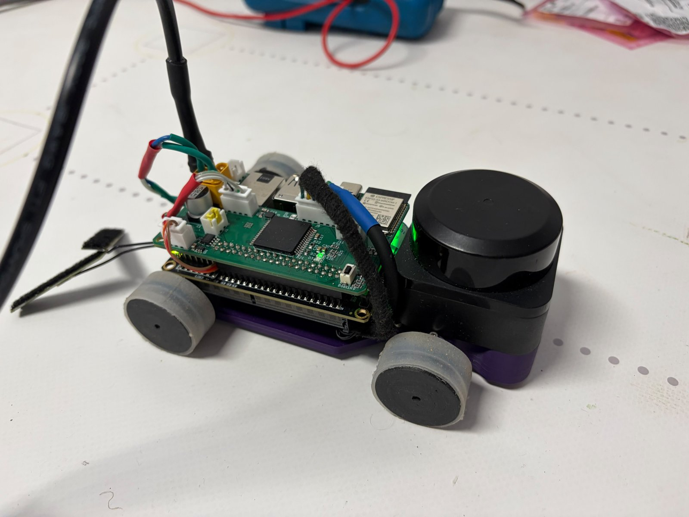
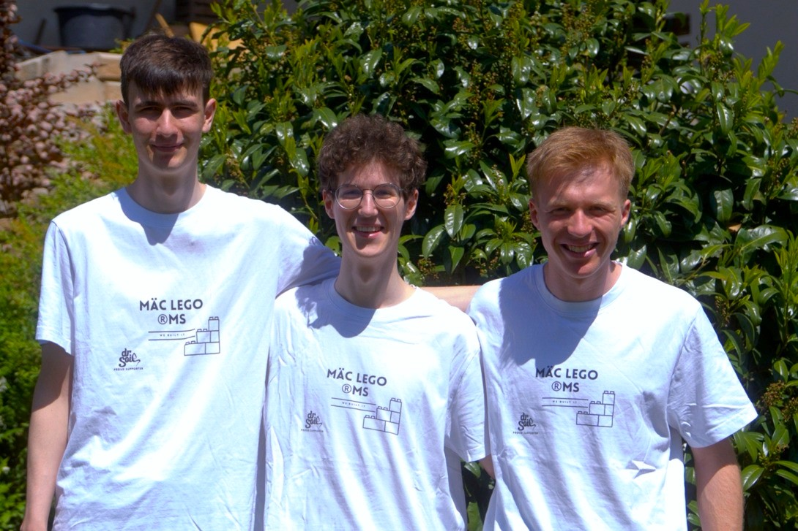

# Overview

<!--
Owner: all. One page. Judges spend 15–20 minutes on the whole documentation,
so this page has to tell them where everything is.
- the vehicle in one paragraph (what makes it different)
- key numbers table: mass, footprint, top speed used, sensors, compute, battery
- photo of the vehicle + team photo (link v-photos/, t-photos/)
- video links for both challenges (video/video.md)
- map of this journal: which chapter answers which rubric criterion
-->

| Rubric criterion | Chapter |
|---|---|
| 1 Mobility & mechanical design | [Mobility and mechanical design](02-mobility.md) |
| 2 Power & sensor architecture | [Power and sensor architecture](03-power-sensors.md) |
| 3 Software architecture & obstacle strategy | [Software architecture and obstacle strategy](04-software.md) |
| 4 Systems thinking & engineering decisions | [Systems thinking and engineering decisions](05-systems.md) |
| 5 Reproducibility & GitHub quality | [Reproducibility](06-reproducibility.md) |

## The vehicle at a glance

Napoleon is a front-steered, rear-driven vehicle on a screw-jointed 3D-printed
monocoque. A Jetson Orin Nano runs perception, estimation and planning; an
ESP32-S3 on our own main PCB drives the motor and the steering servo. The table
compares it with the LEGO hybrid that we drove at the national final.

{width=55%}

| Parameter | National final (LEGO hybrid) | Napoleon | Source |
|---|---|---|---|
| L × W × H without body | 170 × 140 × 170 mm | 160 × 111 × 61 mm | Fusion 360 |
| L × W × H with VW T1 body | – | 182 × 111 × 84 mm | STEP export |
| Wheelbase | 83 mm | 102 mm | CAD, kingpin axis to rear axle |
| Track width front / rear | 105 mm | 97 / 96 mm | CAD, wheel centres |
| Ground clearance | 8 mm | 2.0 mm (tie-rod ends) | CAD |
| Wheel diameter | 67 mm (LEGO Spike) | 32 mm nominal, 30.0 mm effective | CAD; [EKF encoder model](04-software.md#localisation) |
| Steering | direct link, parallel (0 % Ackermann) | Ackermann linkage, steel tie rod | [Steering](02-mobility.md#steering) |
| Mechanical steering lock inner / outer | ±35° | 58° / 36.5° | CAD linkage analysis |
| Drive motor | Pololu 20D 31:1, 450 rpm, no encoder | 25GA370, 1000 rpm at 12 V, Hall encoder | data sheets |
| Final drive | printed gear on a LEGO differential | brass bevel gears 1:1, rigid axle | [Drive train](02-mobility.md#drive-train-torque-and-speed) |
| Theoretical top speed | 1.31 m/s | 1.68 m/s (12 V, no load) | [Speed and acceleration](02-mobility.md#speed-and-acceleration) |
| LEGO content | 50 % | 0 % | – |
| Total mass (with body) | 803 g | 575 g ‡ | test T01 |
| Centre of gravity | not measured | 31 mm above ground ‡ | test T02 |
| Run time open / obstacle challenge | ≈30 s / ≈80 s | ≈27 s / ≈80 s incl. parking, varying from run to run | [open](04-software.md#open-challenge), [obstacle](04-software.md#obstacle-challenge) challenge |

‡ still being measured, see [Validation status](02-mobility.md#validation-status).

<!-- CHECK (team): where do the national-final run times (≈30 s / ≈80 s) come
from? -->

## Team

Team MäcLEGO started at the Rabanus-Maurus-Schule in Fulda. In the meantime all
three of us are at university: Jannik studies robotics, Clemens digital
engineering in mechanical engineering and Finn mathematics.

{width=60%}

| Member | Responsibility |
|---|---|
| Clemens | mechanical design: chassis, steering, drive train, tyres, body |
| Jannik | electronics and main PCB, parts of the software |
| Finn | software: estimation, perception, planning and control |

We split the work this way because it matches what each of us is most
interested in.

## Use of AI tools

We used AI assistants (Claude, by Anthropic) while preparing this journal and
the repository. They helped us collect material from our code, schematics,
measurements and notes into a structured document, draft and translate text,
write the scripts that turn our recordings into figures and the bench-test tool,
and check the documentation against the code. That made our work faster and
better organised.

The vehicle itself is our own work: the mechanical design, the electronics and
the PCB, the software architecture and its algorithms, every measurement and
every engineering decision. We reviewed what is written here and can explain it.
