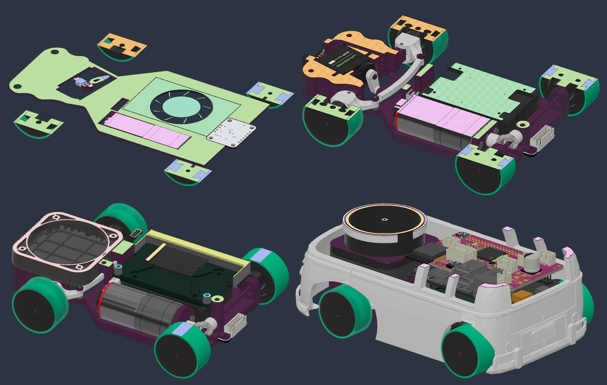
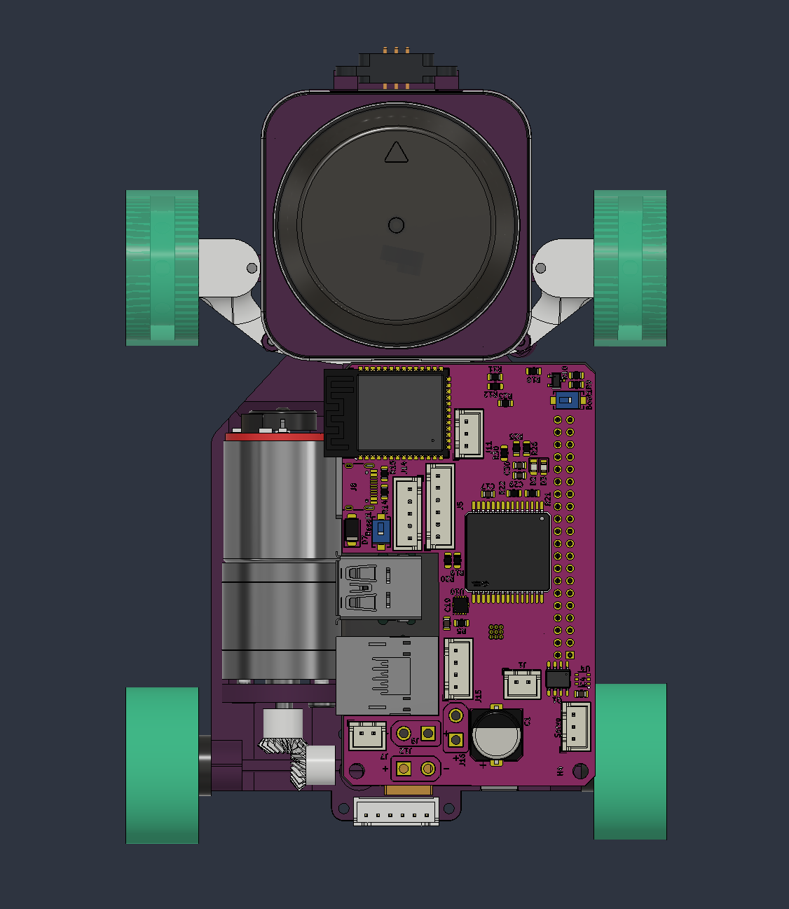
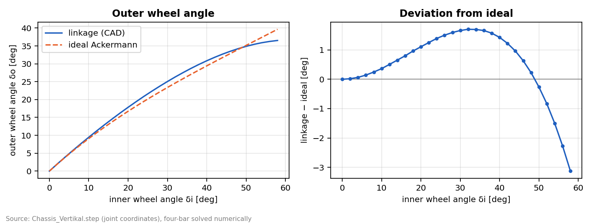
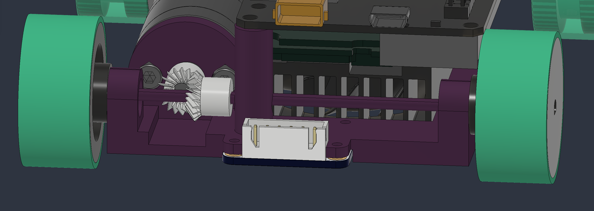

# Mobility and mechanical design

<!--
Owner: Clemens. Rubric criterion 1.
4 points: clear explanation of chassis, drive and steering; diagrams; reproducible.
6 points: torque and speed reasoning; trade-offs; why components were chosen;
tests or iterations that changed the design and improved performance.
Status 01.10.: Clemens' draft (Hardware.zip, commit de8f8ce) integrated, language
and format aligned with the other chapters, cross-checked against chapters 2
and 3. Driven steering angles replaced by the measured steering calibration.
CHECK before submission: every value marked ‡ is still a placeholder from the
test plan (docs/data/manual/mobility_measurements.xlsx). Replace it with a
measured value or delete it - placeholders must not be submitted as data.
-->

The 2026 vehicle, **Napoleon**, replaces the LEGO-Technic hybrid of the national
final with a screw-jointed monocoque, an Ackermann steering linkage and a rigid
rear axle. Three limitations of the old platform triggered the redesign: steering
play, parallel steering without Ackermann geometry, and a vehicle size set by the
standard Jetson developer kit. Moving to the compact Seeed A603 carrier board and
an SMD-assembled main PCB ([chapter 2](03-power-sensors.md#pcb-implementation))
freed the space that made a consistent mechanical redesign possible. The key
figures are compared with the national-final robot in
[the overview](01-overview.md#the-vehicle-at-a-glance).

Since the national final the main assemblies went through about 205 CAD versions
(chassis v96, steering v40, C-profile knuckle v54, tyres v11, body v4), against
about 120 design cycles for the entire previous robot.

> Values marked ‡ come from the mechanical test plan and are still being
> measured; the state of every test is listed under
> [Validation status](#validation-status). Unmarked values are CAD data, data
> sheets or measurements documented in chapters 2 and 3.

## Chassis

### Structural concept

Every component is screwed directly to one monocoque, "Chassis Vertikal". The
national-final robot combined LEGO Technic with printed parts. Every LEGO
interface was a fit with clearance and therefore one more link in the tolerance
chain, so LEGO was removed completely. The detachable body carries no load; it is
connected mechanically and electrically through pogo pins
([Body](#body-vw-t1)).

| Aspect | National final (LEGO hybrid) | Napoleon | Effect |
|---|---|---|---|
| Base structure | LEGO frame + FDM parts | FDM monocoque + SLA precision parts, cable routing and screws modelled | no LEGO interface left in the tolerance chain |
| Structural joints | LEGO pins, at least 3 per printed part | ≈14 × M2, 2 × M2.5, 3 × M3 | defined preload instead of pin clearance |
| Bearings | none (plastic on a LEGO axle) | purchased steel ball bearings 3 × 8 × 4 mm, pressed in | defined axis, low friction |
| Tolerances | one scaling parameter for LEGO holes | global user parameters: screw 0.22 mm, clearance fit 0.30 mm, press fit 0.08 mm (SLA: half) | the same fit on every part, imported into every new Fusion file |
| Replacing a component | partial disassembly, sometimes destructive | at most 2 screws, no other part removed first | fast repair during testing and competition |
| Full assembly | not recorded, cyanoacrylate needed | 30–40 min | faster rebuilds |

### Packaging in four levels

The components are stacked vertically in four levels instead of being spread
out flat; this is where the chassis got its name, "Chassis Vertikal".

1. **Base plate.** Carries the drive motor, recessed into the plate, and the IMU
   directly above the rear axle.
2. **Steering level.** Sits directly on the base plate and holds the steering
   servo and the linkage. Its cut-outs follow the parts of the levels above and
   below.
3. **Jetson level.** The Jetson Orin Nano module on the A603 carrier, with the
   fan blowing downwards through the open base plate.
4. **Top level.** Main PCB, camera holder and all connectors.

The LiDAR is not a level of its own. The RPLIDAR S3 sits in the front section on
its own mount at the height of the Jetson level, and its scan plane at 55 mm runs
at the height of the main PCB, which is why the PCB blocks the rear sector of the
scan ([Sensor mounting](#sensor-mounting)). The 4S LiPo sits at the rear, above
the motor and the drive axle.

{width=90%}

{width=50%}

**Centre of gravity.** Materials are assigned to every part in Fusion 360, so the
CAD model gives a centre of gravity (CoG). It lies slightly off the centre line,
because the Jetson, one of the heaviest components, does not sit on it. The real
robot is checked with two scales and a tilt test (test T02):

| Quantity | CAD, sum of weighed parts ‡ | Scales and tilt test ‡ |
|---|---|---|
| Mass with body | 573 g | 575 g |
| CoG ahead of the rear axle | 60.9 mm | 59.5 mm |
| Front-axle load | 60 % | 58 % |
| CoG off the centre line | 3.3 mm | 2.7 mm |
| CoG above ground | 30.2 mm | 31.3 mm |

Data: [`mobility_measurements.xlsx`](../data/manual/mobility_measurements.xlsx),
sheet `Mass_CoG`. The body and the camera add 68 g ‡; without them the CoG drops
by 3.7 mm ‡.

**Why the motor lies lengthways.** A transverse motor directly on the rear axle
was the obvious alternative and was designed first (V1 base plate, June). It was
rejected for three reasons, all of them set by the Jetson stack:

- **It does not fit between the rear wheels.** The inner faces of the rear tyres
  are 76 mm apart. The motor alone is 70 mm long, and the bevel or spur stage on
  the axle needs another ≈10 mm. The track would have had to grow, making the
  robot wider.
- **It does not make the robot shorter.** The Jetson module ends 3.4 mm in front
  of the rear axle. A transverse motor cannot move forward under the Jetson, so
  it would sit on or behind the axle and add up to 25 mm of overhang, or push the
  Jetson forward and lengthen the wheelbase.
- **The lengthways position uses space that already exists.** The motor lies
  beside the Jetson module, in a strip that is exactly as long as the module
  (70 mm against 69.6 mm) and that the carrier board overhangs anyway. The
  battery sits above it. The motor therefore adds neither length nor width.

This was only possible after the differential was removed
([Rigid axle](#rigid-axle-instead-of-a-differential)). The result is a vehicle
about 20 mm shorter than the transverse variant.

### Joining, fits and maintainability

SLA parts get modelled threads. FDM parts get plain holes sized with the screw
tolerance, and the screw cuts its own thread. Nuts are used only in the steering
linkage, as jam nuts, where the joints must stay free to rotate. The bearings are
pressed into the front knuckles (the C-profiles) with a vice and into the rear
by hand.

All tolerances are global user parameters in Fusion 360 and referenced by every
part. Changing one value updates every fit in the robot; this replaces the single
LEGO scaling parameter of the previous design.

### Materials and manufacturing

Each part group gets the process that fits its load and precision, instead of one
material for the whole robot. The national-final robot used only PLA, because the
LEGO pins needed an accuracy of about 0.1 mm and PLA has a 21.1 % higher tensile
strength than PETG \[[1](99-references.md#ref-1)\]. Without LEGO interfaces the
process can be chosen per part.

| Part group | Process / material | Key property | Reason |
|---|---|---|---|
| Monocoque, front section, large parts | FDM, Bambu Lab PLA Matte (X1 Carbon; 0.2 mm layers, 3 walls, 12 % infill) | dimensionally stable, fast to iterate; slightly flexible | large volume, low cost, short print time |
| Steering knuckles (C-profiles), servo horn, small linkage parts | SLA, Anycubic ABS-Like Resin Pro 2 (Photon Mono M7 Pro) | tensile strength 35–45 MPa, Shore D 82–84 \[[2](99-references.md#ref-2)\] | features too small for FDM; better surface accuracy, at the cost of washing and curing |
| Wheel rims | FDM, SUNLU PA6-CF (20 % carbon fibre) | flexural modulus 8.6 GPa, tensile strength 112 MPa, HDT 203 °C \[[3](99-references.md#ref-3)\] | the rim must not deform, so the tyre is the only compliant element |
| Axles, tie rod | steel, purchased | – | no bending, replaceable, adjustable |
| Bevel gears | brass, purchased | – | wear-free tooth contact; standard bore, so the fit on the shaft is defined |
| Bearings | steel ball bearings 3 × 8 × 4 mm, purchased | – | defined rotation axis, fits the axle directly |

PA6-CF is hygroscopic and is dried in an AMS dryer before printing.

**Why SLA.** The first steering ball joints were printed in FDM. After a few days
of testing they showed measurable wear and play. At the same time the linkage
parts became smaller with every iteration, until their features were below what
the FDM printers could reproduce. A resin printer was bought for this reason.
Later the tie rod and the ball joints were replaced by purchased steel tie-rod
ends, because the SLA tie rod bent over time.

**Failure: cracked C-profiles.** In one iteration the mounting holes of the
C-profile knuckles sat too close to the outer wall and the parts cracked. The wall
around the holes was thickened in the following versions (v54). A static FEA of
the failed and the current version is planned (test T16).

The national-final robot used LEGO ABS axles, which bent under load, and LEGO
gears, which skipped. Both were replaced by steel axles and brass bevel gears.

### Sensor mounting

The trade-off is the same as at the national final: LiDAR field of view against
compact electronics, but its weighting changed. The camera now gives every LiDAR
point a colour ([chapter 3](04-software.md#colour)), so it has to sit as close as
possible to the LiDAR scan plane. The national-final robot tapered the front to
the width of the servo driver; since the servo, motor and LiDAR drivers moved onto
the main PCB, that constraint is gone.

Coordinates are relative to the rear-axle centre on the ground, $x$ forward,
$z$ up.

| Sensor | National final (LEGO hybrid) | Napoleon | Mounting |
|---|---|---|---|
| LiDAR | InnoMaker STL-19P, scan plane $z \approx 60$ mm | Slamtec RPLIDAR S3, $x \approx 111$ mm, scan plane $z \approx 55$ mm | screwed to the monocoque, no isolation |
| Usable LiDAR field of view | ≈250° | 240° | the main PCB blocks the rear (measured from −33° to +59° around the rear); the software cuts ±60° |
| Camera | directional CSI camera, $z = 80$ mm | PiCam360 fisheye (197° lens, facing the ceiling), directly above the LiDAR | held by the body; separate holder without body |
| IMU | BNO055 near the rear axle | BNO055 above the rear-axle centre ($x \approx 0$ mm, $z \approx 5$ mm) | screwed to the base plate |

The LiDAR sits lower than before, which keeps the offset to the camera small. The
price is the field of view: the main PCB at scan height blocks the rear, so the
software uses 240° ([chapter 3](04-software.md#colour)), about 10° less than the
national-final robot. A full 360° view would need a lower Jetson and therefore a
custom cooler; a higher LiDAR would increase the camera offset again. The current
position is a deliberate compromise: what the robot needs is the view ahead and
to the sides, where the next straight and its pillars are.

The IMU sits above the rear-axle centre, the reference point of the kinematic
bicycle model, where the lateral velocity is zero as long as the tyres do not
slip. Its yaw rate needs no lever-arm correction. Neither the IMU nor the LiDAR is
isolated:
[chapter 2](03-power-sensors.md#interference-measured-and-it-is-mechanical) shows
that the drivetrain vibration stays out of the yaw axis.

### Body: VW T1

Napoleon carries a detachable body shaped like a VW T1 bus (v4). It has no
structural function but holds the fisheye camera and the LED lighting. With the
body the vehicle measures 182 × 111 × 84 mm.

The body sits on pogo pins, which locate it and power the LEDs, so no cable has
to be plugged when it is mounted. When fitted, it replaces the separate camera
holder. Aerodynamics play no role at our speeds.

The shape was first modelled in Fusion 360 Alias. The final version is based on
a public model, scaled and cut to the wheelbase, the track and the Jetson level.
Free space around the LiDAR scan plane was a fixed boundary condition (to be
verified with and without the body in test T14). Body and camera weigh 68 g ‡.

### Digital twin and CAD workflow

The Fusion 360 model is used as a digital twin, not only as geometry. Every
connection is a joint (rigid, revolute, slider or ball), so the steering can be
moved through its full range. Interference checks and section analyses run on the
moving assembly. Materials are assigned to all parts, so the CoG is read directly
from Fusion and only validated on the real robot.

The project is split into top-level designs (chassis, steering, C-profile, tyres,
robot stand and the full assembly "Napoleon") and folders for the body, purchased
parts (with an electronics subfolder) and obsolete versions. Two scripts support
the work: one names components automatically, one highlights under-constrained
sketches.

For seven versions the steering model did not match the physical linkage, because
the modelled joints did not reproduce the real kinematics. Since then every
steering change is first moved through its range in the digital twin and then
printed as an isolated steering test rig, which saves material and turnaround
time.

A dedicated stand lifts the wheels off the ground. Drivetrain and steering can be
analysed on it, and the software can "drive" without the robot moving; the
vibration sweeps in
[chapter 2](03-power-sensors.md#interference-measured-and-it-is-mechanical) were
recorded on it.

## Steering

### From rack to Ackermann linkage

The steering went through three stages. The LEGO rack and pinion of the regional
final had 2–4° of play from its tolerance chain (servo horn, axle, gear, rack),
and its gears skipped under load, which ended runs. The direct printed link of
the national final reduced the play below 0.5°, but it was parallel steering
(0 % Ackermann), limited to ±35°, and occasionally broke or came loose at the
LEGO H-profiles.

| Feature | LEGO rack (regional final) | Direct link (national final) | Ackermann linkage (Napoleon) | Effect |
|---|---|---|---|---|
| Transmission chain | horn → axle → gear → rack | horn → tie rod | horn → tie-rod end → tie rod → steering arm → knuckle | correct angle at each wheel |
| Ackermann share | 0 % | 0 % | ≈100 % by the design rule ([Ackermann geometry](#ackermann-geometry)) | less tyre scrub in tight corners |
| Mechanical steering lock | not documented | ±35° | 58° inner / 36.5° outer | tighter turning circle |
| Reversal play | ≈2–4° | < 0.5° (measured, max. 0.5°) | 0.7° max., ±0.35° ‡ (with paper inserts) | see [Static wheel angles and play](#static-wheel-angles-and-play) |
| Joints | LEGO | printed / LEGO | SLA horn, steel tie-rod ends, rivet kingpins, wheel axles in ball bearings | no wear since the switch to steel |
| Servo | Waveshare SC09 | Waveshare SC09 | Waveshare SC09, rotated by 12° | the servo gearbox is now the largest source of play |

### Kinematic chain

The SC09 drives an SLA servo horn. A steel tie-rod end connects the horn to the
tie rod, which links both steering arms. Each steering arm is part of a C-profile
knuckle that pivots on a steel rivet as its kingpin. The wheel axle runs in a
press-fit ball bearing in the knuckle and is held axially by a retaining ring.
Before the ring was added, the front wheels slid out of their bearings; this was
the only mechanical failure in test runs since the switch to the monocoque.

The purchased tie-rod ends allow 20° of articulation, the printed ball joints
allowed 44°. To keep the joints inside their range at full lock, the servo was
rotated by 12°. As a result its travel is asymmetric: from the centre at 15.69° it
turns 67.9° to the right stop (83.62°) and 97.9° to the left stop (−82.16°). This
is one reason why the steering table
([chapter 3](04-software.md#lane-following)) is measured separately for each
side.

Camber, caster and toe are 0° by design. With cast tyres, 0° camber gives the
largest contact patch.

### Ackermann geometry

The steering arms follow the classic Ackermann rule
\[[4](99-references.md#ref-4)\]: their extensions meet at the centre of the rear
axle. With the kingpin distance $k = 59.3$ mm and the wheelbase $L = 102$ mm, the
ideal steering-arm angle is

$$\beta = \arctan\frac{k}{2L} = 16.2°$$

The CAD model has 15.3° (left) and 16.0° (right), which is ≈100 % Ackermann by
this rule.

A four-bar linkage meets the ideal condition exactly only near straight ahead. The
ideal relation between the inner wheel angle $\delta_i$ and the outer wheel angle
$\delta_o$ is

$$\cot\delta_o - \cot\delta_i = \frac{k}{L}$$

The real linkage was solved numerically from the joint coordinates of the STEP
model. It reproduces the angles of the Fusion motion study (58° / 36.5°).

| Inner wheel $\delta_i$ | Outer, linkage | Outer, ideal | Deviation | Local Ackermann share |
|---|---|---|---|---|
| 10° | 9.5° | 9.1° | +0.4° | 60 % |
| 20° | 17.8° | 16.7° | +1.1° | 66 % |
| 30° | 25.0° | 23.4° | +1.7° | 75 % |
| 40° | 30.9° | 29.4° | +1.4° | 86 % |
| 50° | 34.9° | 35.1° | −0.3° | 102 % |
| 58° (full lock) | 36.5° | 39.7° | −3.1° | 117 % |

{width=90%}

Up to about 49° the outer wheel turns slightly too far (local share below 100 %),
near full lock too little. Below 30°, where the robot drives almost all the time,
the deviation stays under 1.7°. Geometrically the smallest radius at the
rear-axle centre is $R = L/\tan\delta_i + k/2 = 93$ mm; how much of it can be
driven is the topic of [Mechanical lock vs driven lock](#mechanical-lock-vs-driven-lock).

### Static wheel angles and play

On the stand, both wheel angles are photographed from above for nine servo
commands, once approached from the left and once from the right (test T05). The
bicycle-equivalent angle $\delta$ follows from
$\cot\delta = (\cot\delta_L + \cot\delta_R)/2$.

| Result | Value |
|---|---|
| Full lock left, inner / outer | 55.0° / 35.9° ‡ (CAD: 58° / 36.5°) |
| Full lock right, inner / outer | 57.3° / 36.4° ‡ |
| Reversal play, max. | 0.7° ‡ (±0.35°) |
| Deviation from a linear servo-to-angle map | mean 1.9°, max. 3.9° ‡ |

Data: sheet `Steering_Target_Actual`, which also holds the series of the LEGO
rack and the direct link for comparison.

The play comes from four links. A linear clearance $s$ along the tie-rod path
turns the steering arm (radius $r = 15.55$ mm, CAD) by
$\Delta\delta = \arctan(s/r)$. The clearances below are design estimates:

| Link | Pairing | Clearance | Wheel angle without insert | Wheel angle with paper insert |
|---|---|---|---|---|
| S | servo gearbox and spline (SC09) | ≈1° at the horn | 0.80° | 0.80° |
| G1 | servo horn ↔ tie-rod end | 0.2 mm | 0.74° | ≈0° |
| G2 | tie-rod end ↔ steering arm | 0.3 mm | 1.11° | ≈0° |
| G3 | kingpin in knuckle | 0.2 mm | 0.74° | ≈0° |
| Worst case (sum) | – | – | 3.38° (±1.69°) | 0.80° (±0.40°) |
| Statistical (root sum square) | – | – | 1.72° (±0.86°) | 0.80° (±0.40°) |

A paper insert of 0.08–0.10 mm fills the hole clearances of G1–G3. What remains is
the servo gearbox, and the measured 0.7° ‡ matches that. Without closed-loop
correction, play causes a curvature error $\kappa = \Delta\delta/L$; after 0.5 m
that is 1.8 cm of lateral offset without inserts and 0.9 cm with them, which the
controller has to correct continuously.

The linkage gives up some of the directness of the national-final direct link in
exchange for correct Ackermann angles and a much larger lock. Against the LEGO
rack the play is clearly lower. The next step is a servo with a magnetic encoder
and a stiffer gearbox (Feetech STS3032, 12 bit, 4.5 kg·cm stall torque).

### Mechanical lock vs driven lock

The mechanics reach 58° at the inner wheel, a bicycle-equivalent angle of 45°
(CAD, from the formula above). While driving, the robot reaches only about half
of that. The steering calibration
([chapter 3](04-software.md#lane-following)) derives the effective angle from the
measured yaw rate and speed:

| Full lock | Static (CAD) | Driven, 0.35 m/s | Driven, 0.50 m/s | Driven, 0.75 m/s |
|---|---|---|---|---|
| Left | 45° | 21.9° | 22.1° | 19.4° |
| Right | 45° | 24.7° | 23.8° | 23.4° |
| Smallest radius at the rear-axle centre | 93 mm | 217–248 mm | 227–246 mm | 231–284 mm |

The difference is too large for steering play. The cause is the rigid rear axle
([Rigid axle](#rigid-axle-instead-of-a-differential)). At a radius of 0.1 m the
inner and outer rear wheel would need speeds that differ by a factor of three, but
the axle forces them to turn equally, so both scrub. The scrub creates a yaw
moment against the turn, and the robot follows a wider circle than the front
wheels point to. The loss grows as the radius shrinks, which is why it is largest
at full lock and small near straight ahead. Speed adds a smaller share on top:
between 0.35 and 0.75 m/s the effective full lock drops by 1.3° (right) to 2.5°
(left), i.e. 0.7–1.7° per m/s² of lateral acceleration.

This is why the software never uses a fixed servo-to-angle model: the measured
steering table per speed already contains the scrub.

### Steering speed

According to the data sheet the SC09 needs 0.1 s per 60° without load, so its
165.8° of travel take 0.28 s. On the stand, a step from the centre to the left
stop (97.9°) took 0.35 s ‡, including 50 ms ‡ until the horn started to move. At
0.5 m/s the robot travels about 20 cm during a full lock-to-lock change, which
limits the speed in S-curves between pillar rows.

### First circular test drives

Two circular runs on 25 September were logged with the drive monitor. The
software commanded a constant speed and yaw rate; the speed came from the
encoder, the yaw rate from the IMU.

| Run | $v$ commanded | $v$ measured | Yaw rate commanded | Yaw rate measured | Ratio | Radius | Oscillation | Wheel frequency |
|---|---|---|---|---|---|---|---|---|
| 1 | 0.30 m/s | 0.300 m/s | 0.30 rad/s | 0.589 rad/s | 1.94 | 0.51 m | 3.18 Hz | 2.98 Hz |
| 2 | 0.50 m/s | 0.505 m/s | 0.50 rad/s | 1.132 rad/s | 2.21 | 0.45 m | 5.31 Hz | 5.02 Hz |

- The speed control deviated by less than 1 % in steady state.
- The steering turned about twice as far as commanded, more so at higher speed.
  These two runs still used the steering table of the previous vehicle. With
  the table measured again on Napoleon
  ([chapter 3](04-software.md#lane-following)), the ratio of measured to
  commanded yaw rate over all test runs from 26 September is 1.13 in the median
  (0.9–1.5, [chapter 3](04-software.md#lane-following)).
- The robot came back to within a few millimetres of its start point after each
  lap. The error was systematic, so a calibration could remove it.
- A superimposed oscillation scaled exactly with speed, once per wheel
  revolution (ratio 1.06). Its cause was the tyre casting, not the steering:
  [Tyres](#tyres-cast-silicone) describes how it was found and removed.

## Drive train, torque and speed

Napoleon uses a 25GA370 gear motor (1000 rpm at 12 V, sold as "BORDSTRACT"), with
an integrated Hall encoder that gives 408 counts per wheel revolution
([chapter 2](03-power-sensors.md#wheel-encoder)). It drives the rear axle 1:1.
The encoder closes the speed loop, which the national-final robot did not have,
and it allowed the 12 V motor rail to be removed from the PCB
([chapter 2](03-power-sensors.md#the-12-v-rail-was-removed--and-software-is-why)).

{width=90%}

### Motor selection

On the national-final robot the position of the motor tied the length of the
robot directly to the length of the motor. A motor with an encoder is longer, so
it would have made the robot too long. Napoleon decouples the two: the motor lies
lengthways beside the Jetson module, off-centre and recessed into the base plate
([Packaging](#packaging-in-four-levels)).

| Motor | No-load speed at 12 V | Stall torque | $v_0$ at Ø 32 mm, 1:1 | Encoder counts per wheel revolution | Size | Mass |
|---|---|---|---|---|---|---|
| Pololu 20D 31:1 (national final) \[[5](99-references.md#ref-5)\] | 450 rpm | 2.4 kg·cm | 1.31 m/s (Ø 67 mm, via differential) | none | Ø 20 × 43 mm | – |
| **25GA370, 1000 rpm (chosen)** | 1000 rpm | not specified | 1.68 m/s | 408 | Ø 24.4 × 70 mm | 94 g ‡ |
| Pololu 25D 4.4:1 HP with encoder (#4841) \[[6](99-references.md#ref-6)\] | 2200 rpm | 1.7 kg·cm | 3.69 m/s | 211 | Ø 25 × 63 mm | – |
| Pololu 25D 9.7:1 HP with encoder (#4842) \[[6](99-references.md#ref-6)\] | 1000 rpm | 3.9 kg·cm | 1.68 m/s | 465 | Ø 25 × 63 mm | – |
| Pololu 37D 10:1 with encoder (#4758) \[[7](99-references.md#ref-7)\] | 1000 rpm | 4.9 kg·cm | 1.68 m/s | 640 | Ø 37 × 65 mm | 190 g |

**Why not the 25D 4.4:1.** It is geared for 3.7 m/s and has the lowest stall
torque of all candidates. At our driving speeds of 0.35–0.75 m/s it would run at
10–20 % of its speed range. Between the regional and the national final the robot
drove with the faster Pololu 25:1, several iterations before the 20D 31:1 of the
national final; it had already shown that a small torque reserve at low duty
makes the launch non-linear. Its encoder also gives only half the resolution.

**Why not the 25D 9.7:1.** Speed and torque are in the same class as the 25GA370.
It was rejected because its encoder does not work with the 3.3 V logic level of
the ESP32-S3. Adapting it would have meant a new PCB revision with two to three
weeks of lead time, for a more expensive motor.

**Why not the 37D 10:1.** It has the most torque and the finest encoder, but it
weighs 190 g, about twice the 25GA370, and its 37 mm diameter would have needed a
deeper recess or a higher Jetson level. More torque also buys nothing on this
robot: driving into a wall at full duty, the tyres lose grip at a winding current
of about 0.53 A, far below stall
([chapter 2](03-power-sensors.md#the-operating-envelope-is-bounded-by-traction-not-by-stall)).
The drivetrain is limited by traction, not by the motor.

The 25GA370 leaves enough headroom for faster speed profiles: at 100 % PWM on 4S
it reaches 1.72 m/s ‡, more than twice the 0.75 m/s currently used on straights.

### Speed and acceleration

The theoretical no-load speed $v_0$ follows from the output speed $n$, the gear
ratio $i$ and the wheel diameter $d$:

$$v_0 = \frac{n \cdot \pi \cdot d}{60 \cdot i} = \frac{1000 \cdot \pi \cdot 0.032\ \text{m}}{60 \cdot 1} \approx 1.68\ \text{m/s}$$

The 4S pack (14.8 V nominal) is above the rated 12 V; with speed proportional to
voltage, 100 % PWM would give 2.07 m/s without load.

Acceleration is limited either by the motor or by traction. Only the rear axle is
driven, so traction depends on the rear-axle load, which rises with acceleration
through load transfer. With the friction coefficient $\mu$, the CoG height $h$
and the distance $l_f$ from the CoG to the front axle:

$$a_\text{traction} = \frac{\mu \cdot g \cdot l_f / L}{1 - \mu \cdot h / L}$$

| Quantity | Method | Value |
|---|---|---|
| Theoretical top speed, 12 V | calculation | 1.68 m/s |
| Theoretical top speed, 14.8 V, 100 % PWM | calculation | 2.07 m/s |
| Measured top speed, 100 % PWM, 15.9 V | encoder log, full-throttle step (T07) | 1.72 m/s ‡ |
| Time constant $\tau$ (63.2 %) | step response (T07) | 0.34 s ‡ |
| Max. measured acceleration | step response (T07) | 4.6 m/s² ‡ |
| Traction limit, rear-wheel drive | formula above, $\mu = 0.88$ ‡ | 4.9 m/s² ‡ |
| Deceleration after a halt command | fitted to the stopping distances of runs 38–42 ([chapter 3](04-software.md#obstacle-strategy)) | 0.57 m/s² |
| Rolling resistance incl. drivetrain drag | $c_r = a/g$ | ≤ 0.058 (upper bound, it also contains the drag of gearbox and motor) |
| Limiting factor at launch | wall test ([chapter 2](03-power-sensors.md#the-operating-envelope-is-bounded-by-traction-not-by-stall)) | traction |

<!-- TODO (Clemens): the step-response figure of the draft shows placeholder data.
Add it back (docs/figures/mobility_step_response.png) once test T07 is
measured. -->

The measured acceleration stays just below the traction limit ‡, and the wall test
shows the tyres slipping long before the motor stalls. Stall torque and stall
current were therefore not measured: they are never reached. The vehicle has no
active brake; it coasts, and the controller triggers every halt early by the
coasting distance ([chapter 3](04-software.md#obstacle-strategy)).

### Power transmission

The motor is held by two screws and rests in a recess along its full length,
which takes the reaction torque straight into the monocoque. A pair of brass
bevel gears turns the drive by 90° onto a continuous steel D-shaft that carries
both rear wheels. The rims are press-fitted onto the D-shaft; no slipping has been
observed. The front axles run in press-fit ball bearings in the knuckles and are
secured with retaining rings.

**Fault found by measurement.** The rear bevel gear first sat on the shaft
through an improvised adapter and ran out of true. The IMU vibration sweep in
[chapter 2](03-power-sensors.md#iteration-locating-and-removing-the-vibration-source)
found it before the part was inspected: after the repair the pitch noise dropped
by 23–86 %, at the cost of 4–20 % more duty from the tighter fit. A gear that fits
the shaft without any adapter is the third iteration.

### Rigid axle instead of a differential

The differential was removed on purpose. Purchased differentials were too large,
and a ball differential designed for this robot did not fit either. Without it
the motor could lie lengthways and the chassis became shorter. With a rigid axle
both rear wheels turn at the same speed; in a corner of radius $R$ with the track
width $T$ the inner wheel has to slip forwards and the outer wheel backwards by
about

$$s \approx \pm \frac{T}{2R}$$

| Radius at the rear-axle centre | Slip per rear wheel | Required speed ratio inner / outer |
|---|---|---|
| 150 mm | ±32 % | 0.68 / 1.32 |
| 300 mm | ±16 % | 0.84 / 1.16 |
| 450–510 mm (circular test drives) | ±9–11 % | 0.90 / 1.10 |
| 1000 mm | ±5 % | 0.95 / 1.05 |

This is the central trade-off of the drivetrain: a shorter, simpler vehicle
against tyre scrub and understeer in tight corners
([Mechanical lock vs driven lock](#mechanical-lock-vs-driven-lock)). Above
500 mm the slip is below 10 %, and the planner keeps every arc at
$R \geq 0.30$ m ([chapter 3](04-software.md#lane-following)), so the effect was
accepted and is handled by the measured steering table.

### Tyres: cast silicone

The LEGO Spike tyres were replaced by self-cast silicone tyres on PA6-CF rims,
Ø 32 × 15 mm, now in version v11. No purchased tyre of this size had the grip we
needed, and a smaller wheel lowers the whole vehicle and leaves more room for the
steering lock inside the knuckles.

**Material.** The tyres are cast from TFC Troll Factory BL200
\[[8](99-references.md#ref-8)\], a two-component moulding silicone mixed 1:1,
medium-hard at Shore A 35 and translucent. The hardness is a compromise: softer
silicone would grip more but compress further under load and change the rolling
radius, harder silicone would lose grip on the mat. The translucent material
shows air bubbles before a tyre is mounted, so faulty casts are sorted out early.

The rim is deliberately stiff (flexural modulus 8.6 GPa
\[[3](99-references.md#ref-3)\]), so all compliance sits in the tyre and the
rolling radius depends only on the silicone.

**Casting process.**

1. Print the rim (PA6-CF) and the casting mould.
2. Treat the mould with release agent.
3. Centre the rim in the mould.
4. Mix both components 1:1 and pour the silicone in through a separate funnel, so
   the tread surface stays free of a sprue.
5. Remove the funnel and let the tyre cure for about 45 minutes.

**Iteration: the seam in the mould.** The once-per-revolution oscillation of the
first test drives ([First circular test drives](#first-circular-test-drives),
3.18 Hz at 0.30 m/s against a wheel frequency of 2.98 Hz) pointed at the wheels.
The moulds had been printed with an aligned seam: every layer started at the same
angle, which left a small ridge across the mould wall and therefore a bump on
every tyre at the same position. The mould was reprinted with a random seam, and
the centring of the rim was improved. With the new tyres the oscillation was
gone.

**Measured tyre data.**

| Quantity | Value | Source |
|---|---|---|
| Nominal diameter | 32.0 mm | mould |
| Measured diameter, 4 tyres, 3 positions each | 31.98–32.06 mm ‡ | test T12 |
| Runout (max − min per tyre) | ≤ 0.08 mm ‡ | test T12 |
| Mass per wheel (rim + tyre) | 9.2–9.7 g ‡ | test T17 |
| Effective rolling radius under load | 15.0 mm | encoder model of the EKF ([chapter 3](04-software.md#localisation)) |
| Effective diameter from 10 × 2.00 m | 30.03 mm ‡ | test T04 |
| Lateral deviation after 3 m straight, steering at 0 | 21 mm ‡ | test T12 |

The effective radius is 6 % smaller than the nominal one: the Shore A 35 silicone
is compressed under the robot's weight. This is why the encoder is calibrated on
the driven distance and not on the mould diameter.

**Grip.** The friction coefficient $\mu = \tan\alpha$ is measured on an inclined
board covered with competition mat, where $\alpha$ is the angle at which the robot
starts to slide (5 runs each, test T08):

| Direction | Clean | After 3 runs, not cleaned |
|---|---|---|
| Longitudinal (wheels blocked) | $\mu$ = 0.88 ‡ | $\mu$ = 0.69 ‡ |
| Lateral | $\mu$ = 0.99 ‡ | $\mu$ = 0.73 ‡ |
| Lateral, LEGO Spike tyre (comparison) | $\mu$ = 0.59 ‡ | – |

The silicone grips about 70 % better than the old LEGO tyre ‡, but dust from the
mat costs about a quarter of it ‡. The tyres are therefore cleaned before every
calibration and every run.

With $\mu = 0.99$ ‡ the robot slides sideways at 9.7 m/s² ‡, while it would only
tip at $g \cdot (T/2)/h = 15.1$ m/s² ‡. It always slides before it tips, with a
margin of 1.56 ‡.

### Ground clearance and suspension

The ground clearance dropped from 8 mm to about 2 mm; the lowest points are the
tie-rod ends. This lowers the CoG further. The WRO field is a flat mat, so a
suspension would only cost space, and the chassis is rigid. 2 mm are enough on a
properly laid mat.

### Kinematic model

The software describes the vehicle with a kinematic bicycle model
\[[9](99-references.md#ref-9)\] around the rear-axle centre. The CAD wheelbase is
$L = 102$ mm; the software rounds it to 0.10 m. The real steering angle comes from
the measured table ([chapter 3](04-software.md#lane-following)), which already
contains the scrub of the rigid axle.

## Iterations

The mechanical design took about seven months from a first component layout to
"Napoleon". The steering was developed in parallel on its own test rig.

| Date | Milestone |
|---|---|
| 5 March | first concept: components arranged without a chassis, still partly LEGO |
| 21 June | V1 base plate, motor still transverse (previous motor) |
| 4 July | ball joints in the steering |
| 7 July | Jetson mounted with the fan facing down |
| 15 July | new steering geometry, new drive motor |
| 25 July | "Chassis Vertikal" started in parallel to the base plate; steering built as a separate test rig |
| 8 August | LiDAR, servo and motor drivers moved onto the main PCB |
| 14 August | screws modelled, wheels adapted, materials assigned in the digital twin |
| 8 September | steel tie rod purchased, servo rotated by 12°; reliable test runs from here on |
| 24 September | chassis named "Napoleon" |
| 25 September | first logged circular test drives |

### Mechanical trade-offs

| Decision | Gained | Given up |
|---|---|---|
| Compact steering linkage | short front, Ackermann geometry | slightly less lock than a larger linkage would allow |
| Small steering parts in SLA | precision, wear resistance | a second printer and process |
| Rigid axle instead of a differential | lengthways motor, shorter chassis | tyre scrub, driven lock only ≈22–25° |
| Low LiDAR position | small camera–LiDAR offset | 120° of view lost at the rear (240° used, national final: ≈250°) |
| Purchased steel tie-rod ends | no wear, reproducible geometry | 20° articulation limit, servo rotated by 12° |
| Cast silicone tyres, 32 mm | grip, low vehicle | casting effort, regular cleaning |
| 25GA370 instead of a larger motor | mass, height, no PCB change | – (traction-limited anyway) |

### Rejected iterations

- **Transverse motor on the rear axle:** did not fit between the rear wheels and
  made the robot wider without making it shorter
  ([Packaging](#packaging-in-four-levels)).
- **Ball differential:** designed in-house, too large for the space.
- **Printed ball joints (FDM):** worn after a few days; replaced by SLA, then by
  steel tie-rod ends.
- **Seven steering versions on an unrealistic digital twin:** the CAD kinematics
  did not match the real linkage; since then every change is checked on the
  separate test rig.
- **Thin C-profile knuckles:** cracked at holes too close to the outer wall; wall
  thickened.
- **Aligned seam in the tyre mould:** once-per-revolution bump; mould reprinted
  with a random seam.
- **Gear adapter on the drive shaft:** ran out of true; found by the IMU sweep
  ([chapter 2](03-power-sensors.md#iteration-locating-and-removing-the-vibration-source)).

### Lessons learned

- Every removed interface removes a link from the tolerance chain. This was the
  main reason to drop LEGO completely.
- Global tolerance parameters make fits reproducible across materials and
  printers; one value changes every fit.
- Wear parts that can be bought (tie-rod ends, gears, axles) should be bought, but
  only once the prototype geometry is final.
- A second robot would let us develop without taking apart the only working
  vehicle. For next season we will print 1:1 replicas of the expensive
  electronics to build one.

### Future work

- A custom aluminium cooler for the Jetson, which would allow a lower Jetson and a
  full 360° LiDAR view.
- A new body that doubles as the heat exchanger of that cooler.
- A steering servo with a magnetic encoder (Feetech STS3032) to reduce the play
  further.
- An adapter-free drive gear on the D-shaft (third iteration, see
  [Power transmission](#power-transmission)).

## Validation status

| Test | Replaces | Section |
|---|---|---|
| T01/T02 masses, axle loads, CoG | mass and CoG values ‡ | [Packaging](#packaging-in-four-levels) |
| T04 encoder distance calibration | effective diameter ‡ | [Tyres](#tyres-cast-silicone) |
| T05 static wheel angles and play | static lock, play ‡ | [Static wheel angles and play](#static-wheel-angles-and-play) |
| T07 full-throttle step | top speed, $\tau$, acceleration ‡ | [Speed and acceleration](#speed-and-acceleration) |
| T08 inclined board | $\mu$, sliding and tipping limits ‡ | [Tyres](#tyres-cast-silicone) |
| T12/T17 tyre geometry and mass | diameters, runout, straight-line deviation ‡ | [Tyres](#tyres-cast-silicone) |
| T13 servo step | steering step time ‡ | [Steering speed](#steering-speed) |
| T14 LiDAR field of view with and without body | – (240° from the software cut, see [Sensor mounting](#sensor-mounting)) | [Body](#body-vw-t1) |
| T16 FEA C-profile old vs. v54 | – | [Materials and manufacturing](#materials-and-manufacturing) |

The driven steering angles (formerly tests T06/T09) come from the measured
steering calibration ([chapter 3](04-software.md#lane-following)).
