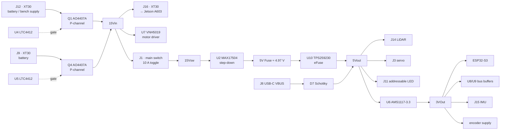
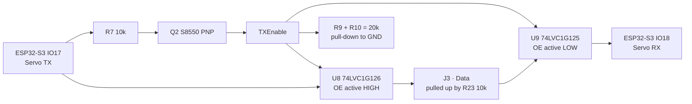

# Power and sensor architecture

<!--
Owner: Jannik. Rubric criterion 2.
4 points: wiring diagram; sensor placement and selection explained; reproducible.
6 points: power budget; sensor trade-offs; placement justified with the field
geometry; calibration method; failure points; iteration evidence.
Evaluators look for: planned power distribution, justified sensor positions,
consideration of noise, interference, shadows.
Sources in the repo: schemes/ (MainPCB, schematic PDF), src/start_robot.sh
(camera exposure / white balance rationale), src/camera_lidar_fusion/README.md.
-->

<!--
Draft status: electrical values are measured (MP1-MP3b) or derived from
schemes/MainPCB and component datasheets. Open items are marked TODO in
comments throughout this chapter.
-->

All electronics of the vehicle sit on a single custom 4-layer PCB that mounts
directly on top of the Jetson Orin Nano carrier board (Seeed A603) as a **stack**:
one 40-pin header carries the mechanical and electrical connection, two M3 screws
prevent the board from tilting off the header. The board is 86.5 × 52 mm.

The stack is the reason for several of the decisions below. It forces the
component height down, it removes every cable that a separate controller board
would need, and it lets the whole vehicle run with a **single USB cable** inside
the chassis.

The board carries four jobs:

1. **Power distribution** — two battery inputs, hot-swap switchover, two
   regulated rails, protection.
2. **Real-time actuation** — an on-board ESP32-S3 with a full H-bridge motor
   driver and a half-duplex serial servo interface.
3. **Sensor interfacing** — LiDAR via an on-board USB-UART bridge, IMU passed
   through to the Jetson's I²C bus.
4. **Telemetry** — battery voltage and motor current measurement fed back to the
   Jetson.

## Power supply and power budget

### Energy source

| | Race pack | Endurance pack |
| --- | --- | --- |
| Type | Ovonic 4S LiPo | Ovonic 4S LiPo |
| Capacity | 450 mAh | 1150 mAh |
| Discharge rating | 60 C (≈27 A) | 60 C (≈69 A) |
| Stored energy | 6.7 Wh | 17.0 Wh |
| Observed runtime | ≈22 min | ≈50 min |
| Implied average current | **≈1.2 A** | **≈1.4 A** |

The two runtimes were measured independently and agree on an average system draw
of roughly **1.2–1.4 A, i.e. 18–20 W**. This is the figure that
[Power budget](#power-budget) has to reproduce component by component.

The smaller pack is used for competition runs, where its lower mass matters and
22 minutes is far beyond a 3-minute round. The larger pack is used for
development and testing, where runtime dominates.

The 60 C rating is not required by the average current — it is required so that
the pack voltage does not sag during motor acceleration, which would otherwise
propagate into the 5 V rail and into the low-voltage warning.

<!-- [FIGURE 8 / MP4] Discharge curves of both packs, voltage over time, with one
vertical marker per completed run and a horizontal line at the warning threshold. -->

#### Battery monitoring

There is no separate BMS or hardware cutoff. The pack voltage is divided by
R6/R8 (100 kΩ / 22 kΩ, filtered by C11 = 100 nF) into GPIO **IO1** of the ESP32-S3:

$$
V_\mathrm{ADC} = V_\mathrm{BAT}\cdot\frac{22}{100+22} = 0.180\,V_\mathrm{BAT}
$$

At a full pack (16.8 V) this yields 3.03 V, just inside the ESP32-S3 ADC range —
the divider is dimensioned specifically for a 4S pack and uses the available range
almost completely.

The firmware raises a warning at **3.8 V per cell (15.2 V pack)** and forwards it
over the UART link to the Jetson, which reacts to it and republishes it as a ROS 2
topic visible in Foxglove. The decision to keep the cutoff in software rather than
in hardware is deliberate: an autonomous vehicle must not lose its compute in the
middle of a scored run, so the reaction is a controlled one rather than a
disconnection.

#### Fault found and fixed: the divider read 18 % high

Cross-checking the reported pack voltage against the bench supply showed **17.52 V
reported at 14.8 V actual** — a factor of 1.184. The consequence is that the
low-voltage warning does not fire where it is supposed to:

| | Reported | Actual |
| --- | ---: | ---: |
| Warning threshold, 3.8 V/cell | 15.2 V | **12.84 V = 3.21 V/cell** |
| Full pack | 19.9 V | 16.8 V |

A warning at 3.21 V/cell is deep-discharge territory. The protection was
ineffective and would have come too late to react to during a scored run.

Cause: a failed resistor in the R6/R8 divider. 17.52 V reported corresponds to
3.159 V at the pin, which is essentially the ESP32-S3 ADC's full scale, so the
reading is at or near saturation. A secondary symptom confirms it — the state of
charge published to Foxglove is computed as `(cell_v - 3.3) / (4.2 - 3.3)`, which
at a reported 4.38 V/cell clamps to 100 % permanently.

The GPIO itself is not at risk. With the lower resistor open, the pin sees the pack
voltage through R6 = 100 kΩ, and the ESP32's clamp diodes limit the current to
(14.8 − 3.3) / 100 kΩ = **115 µA**, two orders of magnitude below what those diodes
tolerate.

**Fix:** the failed resistor was replaced. After the repair the bridge reports
15.56 V and a state of charge of 65 % — the percentage is no longer pinned at 100 %,
so the divider is back in its linear range. <!-- TODO confirm: reported value against a multimeter at the pack terminals -->

The fault is documented here rather than silently repaired because of how it was
found: not by the warning misbehaving, but by cross-checking one measurement
against an independent reference during an unrelated test.

### Dual-input power path

Two XT30 inputs are combined by a pair of **LTC4412 ideal-diode controllers**
driving P-channel MOSFETs (AO4407A). The higher-voltage source takes over
automatically, with no diode drop and no reverse current into the lower source.

**Why this instead of a simple Schottky OR:** a Schottky diode would drop
0.3–0.5 V continuously at ~1.3 A, dissipating around half a watt per branch and
costing runtime. The LTC4412 does the same job with a MOSFET's 28 mΩ-class
on-resistance. It also removes the need for external comparators or control logic,
which was the deciding argument — the part integrates the complete switchover.

**What the second input is actually for.** The two inputs are *not* used as two
parallel batteries. They exist so that a source can be added or removed while the
vehicle is running:

- During maintenance, a bench supply is connected to the second input. The
  vehicle then runs from mains power **without discharging the battery**.
- When a pack runs empty, a fresh pack is plugged into the free input before the
  empty one is removed. The Jetson keeps running throughout.

**Reverse-polarity protection** comes for free: in this topology the P-channel
body diode is oriented so that a reversed pack reverse-biases it and the gate
never turns on.

<!-- [FIGURE MP5] Screenshot of an uninterrupted ROS 2 log across a live battery
swap, together with the Jetson's uptime afterwards. -->

### Switching and the emergency stop concept

The main toggle switch (J1, rated 10 A) sits between `15Vin` and `15Vsw`. It
deliberately does **not** switch the entire vehicle:

| Main switch OFF | State |
| --- | --- |
| Jetson (via J16) | **keeps running** |
| ESP32-S3 | off |
| LiDAR, steering servo, status LED | off |
| VNH5019 motor driver | rail present, but ENA/ENB lose their 3.3 V pull-up → outputs disabled, motor stopped |

This is intentional and follows from the same reasoning as the hot-swap path: the
Jetson runs a full Linux filesystem and must not be cut off abruptly. Pulling its
power on every stop would risk filesystem corruption on the boot medium.

The motor driver is therefore supplied from the unswitched rail. It cannot start
the motor on its own — its enable inputs are pulled up to the 3.3 V rail, which
the switch removes, and its logic inputs are driven only by the ESP32-S3, which
the switch also removes. Cutting the switch is a valid mechanical emergency stop
for the drivetrain while leaving the compute platform alive.

A second, independent emergency stop exists in software (`CMD_EMERGENCY`), plus a
serial watchdog in the ESP32 firmware that zeroes the motor if the link to the
Jetson drops.

Competition start procedure, as required by the rules: the toggle switch powers
the vehicle on, and a separate start button on J7 (GPIO **IO9**) starts the
program. No other interaction is needed.

### Regulation

#### 5 V rail — MAX17504

| Parameter | Value |
| --- | --- |
| Topology | Synchronous step-down, integrated MOSFETs |
| Input range | 4.5–60 V (operating 12.0–16.8 V) |
| Rated output | 3.5 A |
| Feedback divider | R1 = 100 kΩ, R2 = 22.1 kΩ |
| Output voltage | 0.9 V × (1 + 100 / 22.1) = **4.97 V** |
| Inductor | L1 = 6.8 µH |
| Soft start | C3 = 12 nF |
| MODE | tied to GND → forced PWM |

R2 = 22.1 kΩ is an E96 value chosen specifically to land on 5.00 V rather than on
a nearby E12 approximation.

**Why the MAX17504 replaced two LM2678T regulators.** The previous generation used
two through-hole LM2678T regulators in TO-220 — one for 12 V, one for 5 V. The
MAX17504 replaced both with a single SMD part, and this was a combination of four
arguments: good availability at the time of design, few external components, a
higher switching frequency that allows a physically much smaller inductor, and an
SMD package that lowers the profile of the board — which matters directly because
the board is a stack and every millimetre of height is contested.

**MODE tied to GND selects forced-PWM operation** rather than pulse-skipping. This
costs efficiency at light load but keeps the switching frequency constant, which
keeps switching noise at a single predictable frequency instead of spreading it
across a load-dependent spectrum. With a LiDAR and an IMU on the same board, a
predictable noise spectrum was judged more valuable than light-load efficiency.

The measurement in [Interference](#interference-measured-and-it-is-mechanical) confirms
this: no PWM-correlated interference reaches the IMU at all.

#### The 12 V rail was removed — and software is why

The LM2678T generation carried a dedicated 12 V rail for the drive motor. It was
deleted entirely in the redesign: the motor now runs directly from the battery
rail (`15Vin`).

The reason this became possible is not an electrical one. Earlier revisions had no
wheel encoder, so a given PWM duty cycle produced a different speed at a different
battery voltage, and a regulated motor rail was the only way to make the vehicle's
behaviour repeatable. With **encoder feedback (508 pulses per wheel revolution)**
closing the speed loop, the motor supply voltage no longer needs to be constant —
the controller compensates for it.

This removed an entire regulator, its inductor, its capacitors and its board area.
It is the clearest example in this project of a software capability paying for
itself in hardware.

#### 3.3 V rail — AMS1117

A linear regulator was chosen over a second switcher. The 3.3 V rail supplies only
the ESP32-S3, the two bus buffers, the IMU module and the encoder pull-ups — a
small and fairly constant load. The linear part needs no inductor and no feedback
network, which saves board area on a board where area is the binding constraint,
and it introduces no additional switching noise next to the sensor interfaces.

Thermal behaviour is uncritical. The 3.3 V rail supplies the ESP32-S3, two
single-gate buffers, the IMU breakout and a handful of pull-ups — on the order of
100 mA. At a dropout of 5.0 − 3.3 = 1.7 V this dissipates roughly 0.17 W in a
SOT-223 package, which needs no additional heatsinking. The part runs cool in
operation.

### Protection

The 5 V rail is protected by a **TPS259230 eFuse**, and the failure mode it is
designed against is specific:

> If the high-side MOSFET inside the MAX17504 fails short, the full battery
> voltage — up to 16.8 V — appears on the 5 V rail. The RPLIDAR S3 on that rail
> costs approximately 650 €, and would not survive it.

The TPS259230 answers exactly this case:

| Feature | Value | Relevance |
| --- | --- | --- |
| Fixed overvoltage clamp | **6.1 V** | Limits the fault to a level the downstream devices can tolerate |
| Absolute maximum input | **20 V** | Survives the fault itself — 20 V > 16.8 V full pack |
| Adjustable current limit | 1–5 A via R29 | Cable and connector short-circuit protection |
| Reverse current blocking | yes | Prevents the 5 V bulk capacitance from feeding back |
| Thermal shutdown | yes | Disconnects under a sustained clamp condition |
| On-resistance | 28 mΩ | Negligible loss in normal operation |
| Programmable dV/dT | C19 = 180 pF | Controlled output ramp, limits inrush at power-on |

The eFuse has never tripped in operation.

#### Operating limit that follows from this

The protection concept rests on the eFuse surviving the fault it guards against.
Its absolute maximum input is **20 V**, and a full 4S pack is 16.8 V, so the margin
holds on battery. It does **not** hold for an arbitrary bench supply: the Jetson
accepts up to 22 V, and at that setting a regulator failure would exceed the
eFuse's absolute maximum, destroy it, and expose the LiDAR.

**The bench supply must therefore stay below 19 V.** This is an operating limit of
the vehicle, not a recommendation.

#### Current limit: corrected

`R29 = 100 kΩ` set the overload limit to ≈3.75 A typical. Two measurements showed
this to be wrong in both directions.

**It is above the regulator's rating.** The MAX17504 delivers 3.5 A. With the fuse
set to 3.75 A, an overcurrent event drives the regulator into its own current
limit before the eFuse reacts — the overcurrent protection could never act. The
overvoltage clamp, which is the primary reason for choosing the part, was
unaffected by this and always worked.

**It is far above the actual load.** MP1 gives the non-Jetson, non-motor share of
the system as 0.265 A at 14.8 V = 3.9 W. At an assumed converter efficiency of
~90 %, the 5 V rail therefore carries about 3.5 W, or **≈0.7 A**.

**Change applied:** `R29 = 45.3 kΩ` → 2.05 A typical, a value characterised
directly in the datasheet rather than interpolated. The limit now sits below the
regulator's 3.5 A rating, and retains roughly three times the headroom over the
0.7 A measured load.

### Power budget

Measured at the battery rail with a bench supply at 14.8 V (MP1), as total system
current.

| State | Current | Power | Δ vs idle |
| --- | --- | --- | --- |
| Jetson alone, idle | 0.835 A | 12.4 W | — |
| Jetson boot, peak | 0.900 A | 13.3 W | — |
| Full system idle, all nodes running | 1.10 A | 16.3 W | baseline |
| Steering servo holding against resistance | 1.13 A | 16.7 W | +0.03 A |
| Driving, speed 0.3 (realistic race pace) | 1.15 A | 17.0 W | +0.05 A |
| Driving, speed 1.0 | 1.30 A | 19.2 W | +0.20 A |

Data: [`data/manual/mp1_power_budget.csv`](../data/manual/mp1_power_budget.csv).

<!-- [FIGURE 7] Stacked bar chart, one bar per operating state. -->

#### The compute platform dominates, not the drivetrain

The Jetson alone accounts for 0.835 A of the 1.10 A idle draw — **76 % of the
budget**. Everything else together (LiDAR, ESP32-S3, servo, both regulated rails)
accounts for 0.265 A, or 3.9 W. Driving at full speed adds 0.20 A, or 3.0 W.

Two consequences follow, and both shaped later decisions:

1. **Runtime is almost independent of driving style.** The span between standing
   still and full throttle is 18 % of the total draw. Optimising the drivetrain
   for energy would have been wasted effort — the energy goes into perception and
   planning, not into motion.
2. **The 5 V rail carries roughly 0.7 A**, derived from the 3.9 W non-Jetson,
   non-motor share at ~90 % converter efficiency. This is the figure the eFuse
   current limit was set against (see [Protection](#protection)).

#### Cross-check against observed runtime

The power budget and the observed pack runtimes were measured independently. They
agree:

| Pack | Capacity | Predicted at 1.15 A | Observed |
| --- | --- | --- | --- |
| Race | 450 mAh | 23.5 min | ≈22 min |
| Endurance | 1150 mAh | 60 min | ≈50 min |

The race pack matches within 7 %. The endurance pack falls short of the prediction
because a run is ended at the 3.8 V/cell warning rather than at full discharge,
leaving usable capacity unused.

### Motor drive

| | |
| --- | --- |
| Driver | VNH5019ATR-E, full H-bridge |
| Supply | `15Vin`, direct battery voltage |
| Control | IO42 (INA), IO38 (INB), IO41 (PWM), full 0–255 range |
| Enable / diagnostics | ENA and ENB tied together, pulled up via R21 = 10 kΩ |
| Current sense | CS → R22 = 680 Ω → IO8 (ADC) |
| Braking | not used — the vehicle coasts |
| Output traces | MPWRA 1.0 mm, MPWRB 1.5 mm |

The VNH5019 was selected for its integrated feature set — in particular the
built-in current sense output, which removes the need for a separate shunt and
amplifier on a board with no spare area.

Motor specifications (type, rated voltage, gear ratio, stall current) are
documented in [chapter 2](02-mobility.md).

#### Drive current characterisation

The drive current was characterised with the Jetson disconnected (J16 unplugged),
the board fed from a bench supply at 14.8 V and the ESP32-S3 addressed directly
over USB-C. This isolates the board from the Jetson's fluctuating load and reduces
the baseline to a stable **138 mA**.

Because the H-bridge is a switching stage, supply current is not winding current.
During the PWM off-time the winding current freewheels through the bridge and is
not drawn from the battery, so:

$$
I_\mathrm{supply} - I_\mathrm{baseline} \approx D \cdot I_\mathrm{winding}
$$

| duty | D | I_supply | Δ | I_winding = Δ/D |
| ---: | ---: | ---: | ---: | ---: |
| 25 | 0.098 | 152 mA | 14 mA | 143 mA |
| 50 | 0.196 | 161 mA | 23 mA | 117 mA |
| 75 | 0.294 | 172 mA | 34 mA | 116 mA |
| 100 | 0.392 | 183 mA | 45 mA | 115 mA |
| 125 | 0.490 | 195 mA | 57 mA | 116 mA |
| 150 | 0.588 | 207 mA | 69 mA | 117 mA |
| 175 | 0.686 | 219 mA | 81 mA | 118 mA |
| 200 | 0.784 | 232 mA | 94 mA | 120 mA |
| 225 | 0.882 | 245 mA | 107 mA | 121 mA |
| 250 | 0.980 | 255 mA | 117 mA | 119 mA |

Data: [`data/manual/mp2_drive_current.csv`](../data/manual/mp2_drive_current.csv).

**The measurement validates the model.** Across the duty range the supply current
rises by a factor of 8.4 and follows a straight line to within 2.7 mA:

$$
I_\mathrm{supply} - 138\,\mathrm{mA} = 0.469\,\mathrm{mA} \cdot \mathrm{duty}
$$

while the derived winding current stays at **117.7 mA ± 5.5 %** from duty 50
upwards. A freely spinning motor must behave exactly this way: its no-load current
is set by friction and windage, not by the duty cycle, which only sets speed. The
outlier at duty 25 is consistent with the bridge operating near the edge of
discontinuous conduction, where the motor barely turns.

<!-- [FIGURE 12] Supply current and derived winding current over PWM duty — one
curve linear, one flat. -->

#### The operating envelope is bounded by traction, not by stall

Driving the vehicle into a wall at full duty until the tyres break traction draws
**660 mA** from the supply — 522 mA above the 138 mA baseline. This is the highest
current the drivetrain can reach in operation:

| Condition | I_supply | Δ over baseline | Winding current |
| --- | ---: | ---: | ---: |
| Wheels free, duty 250 | 255 mA | 117 mA | 119 mA |
| Driving on the ground, full speed | — | ≈200 mA | ≈200 mA |
| Against a wall, tyres slipping | 660 mA | 522 mA | ≈530 mA |

The true stall current of the motor exceeds the capability of our bench supply and
was never measured — because it is never reached. **The tyres lose grip before the
motor stalls**, which caps the drive current at roughly 0.53 A, about 4.5 times the
free-running value.

For the complete vehicle this gives a worst-case draw of **≈1.62 A (24 W)**: the
1.10 A full-system idle from [Power budget](#power-budget) plus 0.52 A of motor. The
450 mAh race pack, rated for 27 A, is nowhere near its limit; even sustained at
this worst case it would last 16 minutes.

#### Why current is not used for collision detection

The board instruments the motor current: the VNH5019 CS output feeds R22 = 680 Ω
to ground, sampled on IO8. With the device's sense ratio of 140 µA per ampere this
gives

$$
V_\mathrm{CS} = 140\,\mu\mathrm{A/A} \cdot 680\,\Omega = 95\,\mathrm{mV/A}
$$

At the measured no-load winding current of 118 mA the expected signal is 11 mV.
The ADC reports 140 mV and the firmware derives 0 A. 140 mV is the ESP32-S3 ADC's
noise floor — the converter is unusable below roughly 100–150 mV — so the signal
never leaves its dead zone. R22 was estimated rather than calculated, and it is an
order of magnitude too small.

Enlarging R22 would move the signal out of the dead zone. It would still not make
current-based collision detection work on this vehicle, and the reason is
mechanical rather than electrical:

> **The drivetrain has more torque than the tyres have grip.** When the vehicle
> runs into an obstacle the wheels break traction and spin. The motor never
> approaches its stall current, so a collision produces almost no current rise at
> all.

The measured collision case confirms this quantitatively. At the traction-limited
maximum of 0.53 A the sense voltage is

$$
0.53\,\mathrm{A} \cdot 95\,\mathrm{mV/A} = 50\,\mathrm{mV}
$$

which is still below the ADC's 140 mV noise floor. **Even a full-speed collision
produces no measurable signal on this input.** Current-based collision detection
could not have worked on this vehicle at any sense-resistor value that also
tolerates the stall case.

Obstacle and collision handling therefore uses the sensors that do see the
condition:

- **LiDAR** detects obstacles before contact and the planner avoids them.
- **Wheel encoder** detects a stall after contact: duty is commanded, but the
  508-pulse-per-revolution encoder reports no corresponding motion. This is
  independent of supply voltage, of load and of sense-resistor tolerance.

The current sense remains on the board as instrumentation and is published in
telemetry, but it is not part of a control decision.

Sizing R22 correctly is now a calculation rather than a guess. For full ADC scale
at the measured traction limit:

$$
R_{22} = \frac{2.5\,\mathrm{V}}{140\,\mu\mathrm{A/A} \cdot 0.53\,\mathrm{A}} \approx 33\,\mathrm{k}\Omega
$$

This is recorded in [Known limitations](05-systems.md#known-limitations) rather than changed during the
competition season: the function it would serve is already covered by the encoder,
and a working vehicle is not modified two weeks before an event.

#### Encoder interface

Hall-effect encoder, **508 pulses per wheel revolution**, both channels evaluated.
Each channel passes through a calculated RC low-pass filter:

$$
f_c = \frac{1}{2\pi \cdot 1\,\mathrm{k}\Omega \cdot 10\,\mathrm{nF}} = 15.9\,\mathrm{kHz}
$$

with 4.7 kΩ pull-ups to 3.3 V. Motor power, ground, encoder supply and both
encoder channels share a single 6-pin JST connector (J5), so the drivetrain
attaches with one cable.

<!-- TODO: highest expected pulse rate 508 * v / (pi * d_wheel) - needs the wheel diameter, compare against the 15.9 kHz corner frequency. -->

## Wiring

### Interfaces and pin map

#### ESP32-S3 GPIO allocation

| GPIO | Function | GPIO | Function |
| --- | --- | --- | --- |
| IO0 | Boot button | IO17 | Servo TX |
| IO1 | Battery voltage (ADC) | IO18 | Servo RX |
| IO8 | Motor current sense (ADC) | IO38 | VNH5019 INB |
| IO9 | Competition start button | IO40 | Addressable status LED |
| IO10 | Jetson UART | IO41 | VNH5019 PWM |
| IO11 | Jetson UART | IO42 | VNH5019 INA |
| IO15 | Encoder channel A | USB D+/D− | USB-C (native) |
| IO16 | Encoder channel B | EN | Reset button |

#### Connectors

| Ref | Type | Purpose |
| --- | --- | --- |
| J1 | JST-XH 2p | Main toggle switch |
| J3 | JST-XH 3p | Steering servo (5 V, Data, GND) |
| J5 | JST-XH 6p | Motor: A, B, GND, 3V3, ENC A, ENC B |
| J7 | JST-XH 2p | Competition start button |
| J8 | USB-C | ESP32 programming, calibration, bench power |
| J9, J12 | XT30 | Battery / bench supply inputs |
| J10 | 2×20 header | Jetson stack: UART, I²C, GND |
| J11 | JST-XH 3p | Addressable status LED |
| J13 | Hirose FH12 20p | USB 2.0 to Jetson (LiDAR path) |
| J14 | JST-XH 5p | RPLIDAR S3 |
| J15 | JST-XH 4p | BNO055 IMU |
| J16 | XT30 | Power output to Jetson A603 |

The USB-C port is used for firmware upload, steering calibration and maintenance.
The LiDAR is never active on this path — it only runs when the Jetson is powered.

<!-- [FIGURE 5] Vehicle-level wiring diagram: which connector goes to which
physical component, with cable lengths.
[FIGURE 6] Photograph of the board installed on the Jetson, connectors labelled. -->

### Steering servo — half-duplex interface

The steering actuator is a **Waveshare SC09** serial servo using a single-wire
half-duplex asynchronous protocol. Current draw is 0.1 A typical and 0.2 A
maximum, which the 5 V rail absorbs without measurable sag.

The direction of the bus is derived **from the TX line itself**, with no GPIO
involved. When the ESP32 pulls TX low for a start bit, Q2 conducts and raises
`TXEnable`, which simultaneously enables the transmit buffer (active-high OE) and
disables the receive buffer (active-low OE). When the line is idle, R9 + R10 pull
`TXEnable` down and the direction reverses. During the high bits inside a
transmitted byte the transmit buffer goes high-impedance, and R23 (10 kΩ) holds
the bus at its idle level.

This circuit follows Waveshare's reference design for the protocol. The
alternative — switching direction from a GPIO in software — was rejected because
it would put timing-critical work on the ESP32 for every byte.

Early in development the protocol itself caused problems; the interface has been
stable since.

<!-- [FIGURE 10 / MP6] Two-channel oscilloscope capture of Data and TXEnable
across one request/response cycle, with the transmit, turnaround and receive
phases labelled. -->

### PCB implementation

| | |
| --- | --- |
| Dimensions | 86.5 × 52 mm, 1.6 mm |
| Layers | 4 (F.Cu, In1.Cu, In2.Cu, B.Cu) |
| Ground | Copper pour on all four layers; two layers continuous ground |
| Power routing | 2.0 mm for `15Vin`, `15Vsw`, `5V Fuse`; 1.0–1.5 mm for motor and 3.3 V |
| Signal routing | 0.2–0.25 mm |
| Vias | 116 |
| Manufacturer | JLCPCB, ~13 € for 5 bare boards |
| Assembly | Hand-assembled with hot air |
| DRC | Clean |

**Why four layers.** Earlier revisions were two-layer. At the board size demanded
by the stack, routing the motor path, the two regulated rails, the USB
differential pair and the sensor interfaces on two layers was not achievable.
Four layers also allow continuous ground under the signal layers, which is a
signal-integrity argument as much as a routing one.

Power is distributed on wide traces rather than on dedicated power planes, so the
inner layers remain available as ground reference.

<!-- [FIGURE 2] Schematic export (PDF).
[FIGURE 3] Layout, top and bottom.
[FIGURE 4] 3D render of the assembled board. -->

### Design evolution

The board went through five fabricated revisions. Every revision was ordered at
JLCPCB (5 bare boards for ~13 €) and hand-assembled with hot air. The assembled
cost of the current revision is approximately **30 € per board**, dominated by the
motor driver and the ESP32-S3 module.

| Rev | Trigger | Change |
| --- | --- | --- |
| V1 | first PCB attempt | Mostly through-hole, far too large to fit the vehicle. Served as a design exercise. |
| V2 | footprint error | The ESP32-S3 DevKitC footprint was wrong — the module had been sourced from a marketplace listing without a reliable mechanical drawing. Corrected in this revision. |
| V3 | mechanical constraint | Complete redesign, small enough to fit inside the vehicle's protective cage. First ideal-diode dual-input stage. 5 V protected by a TVS diode and a PTC thermistor. |
| V4 | integration | Motor driver moved onto the board. ESP32-S3 module replaces the plug-in DevKit, making the board a self-contained MCU. |
| V5 | stack concept | 40-pin header for direct mounting on the Jetson. New LiDAR interface (USB-UART bridge) and new servo driver stage. |

**No revision failed on first power-up.** Each was released only after a clean DRC
run and a manual net-by-net review against the schematic.

<!-- [FIGURE 14] Photograph of all five boards side by side, one caption line per
revision. All five physical boards are still available. -->

#### Protection: PTC + TVS → eFuse

V3 protected the 5 V rail with a PTC thermistor and a TVS diode. Both were
replaced in the following revisions by a **TPS259230 eFuse**:

| | PTC + TVS (V3) | eFuse (V5) |
| --- | --- | --- |
| Trip threshold | Undefined, temperature-dependent | Set by one resistor, ±8 % |
| Reaction time | Seconds | Microseconds |
| Overvoltage | Clamped by TVS, no current limit | 6.1 V clamp with current limit |
| Recovery | Self-resetting, uncontrolled | Controlled restart, defined dV/dT |

## Sensors: selection and placement

The deliberate split: **the Jetson owns all perception, the ESP32 owns all
actuation.** No sensor used for perception is routed through the microcontroller.

### LiDAR — RPLIDAR S3 via on-board USB bridge

The LiDAR is *not* connected to the ESP32. It connects to J14, and its UART is
converted by an on-board **CP2102N** (U3) into USB, which leaves the board through
J13, a 20-pin FFC connector, to the Jetson's USB 3.0 port via a commercial cable.

Three constraints produced this solution:

1. The Jetson's remaining serial interfaces were already allocated — the 40-pin
   header UART is used by the ESP32 link.
2. The LiDAR's original USB adapter was physically too large for the chassis.
3. The stack concept requires that the board expose as few external cables as
   possible.

Routing the LiDAR through the board's own USB bridge satisfies all three: the
sensor appears to the Jetson as an ordinary USB serial device (consumed by
`sllidar_ros2`), and the vehicle needs exactly one USB cable internally.

The LiDAR is rigidly bolted to the chassis, with no vibration isolation. This has
caused no measurable problems.

### IMU — BNO055 on the Jetson's I²C bus

The BNO055 breakout connects to J15 and is routed straight through to the Jetson's
40-pin header (pins 3/5, I²C), at address **0x28**. It is deliberately *not* on the
ESP32: the IMU is a perception sensor, and putting it on the microcontroller would
have added its data to the already-loaded serial link to the Jetson.

The I²C run is under 10 cm and twisted. Pull-ups are provided by the breakout.

### Camera

USB camera (PiCam 360 class, fisheye). A CSI version with the required field of
view exists only for the Raspberry Pi, which made USB the only option. Handled in
[chapter 4](04-software.md).

### Interference: measured, and it is mechanical

A 187 s recording was made with the wheels free, stepping the motor through the
full PWM range, logging the BNO055 at 100 Hz and the drive-axle speed from the
encoder at 100 Hz. Noise is taken as the standard deviation of the gyroscope
within 0.5 s windows, which removes any real motion and leaves only the
high-frequency content.

| Drive-axle speed | Roll (x) | Pitch (y) | **Yaw (z)** |
| ---: | ---: | ---: | ---: |
| at rest | 0.044 °/s | 0.086 °/s | **0.034 °/s** |
| 10–20 rad/s | 0.268 °/s | 0.269 °/s | **0.039 °/s** |
| 35–50 rad/s | 0.505 °/s | 1.048 °/s | **0.039 °/s** |
| 65–85 rad/s | 0.909 °/s | 2.245 °/s | **0.056 °/s** |
| 85–130 rad/s | 1.375 °/s | 3.407 °/s | **0.082 °/s** |

Two results follow, and both were favourable.

**The noise is vibration, not electrical interference.** The recording contains
coasting phases — the motor is switched off while the wheels are still spinning
down, so the drivetrain turns at full speed with the PWM stage completely idle.
Comparing driven against coasting windows at matched speed:

| Drive-axle speed | Gyro σ driven | Gyro σ coasting | Ratio |
| ---: | ---: | ---: | ---: |
| 1–10 rad/s | 0.0042 | 0.0042 | 0.99 |
| 10–20 rad/s | 0.0064 | 0.0067 | 1.05 |
| 20–35 rad/s | 0.0119 | 0.0130 | 1.09 |
| 35–50 rad/s | 0.0203 | 0.0221 | 1.09 |
| 50–65 rad/s | 0.0295 | 0.0255 | 0.87 |
| 65–85 rad/s | 0.0422 | 0.0458 | 1.09 |
| 85–130 rad/s | 0.0616 | 0.0544 | 0.88 |

Data: bag `PWM_Test`, binned in [`data/mp3_noise_vs_speed.csv`](../data/mp3_noise_vs_speed.csv).

Mean ratio **1.01**, spread 0.87–1.09. Switching the PWM stage off changes nothing.
The noise tracks wheel speed, not duty cycle — it is mechanical vibration from the
rotating drivetrain. **No measurable PWM coupling reaches the IMU**, which is the
return on the four-layer stack-up with continuous ground planes under the signal
layers, and on running the regulator in forced PWM at a fixed frequency.

**The vibration misses the axis that matters.** Pitch noise grows by a factor of
40 from rest to full speed — the signature of an unbalanced rotating drivetrain,
about the wheel axis. Yaw grows by a factor of 2.4, from 0.034 to 0.082 °/s. Yaw
is the only axis the heading estimate integrates, and at full speed it carries
less noise than the pitch axis does *at rest*.

Vibration isolation for the IMU would therefore buy nothing for localisation. This
is why the LiDAR and IMU are both bolted down rigidly, and why no damping was
added.

<!-- [FIGURE 11] Gyroscope noise per axis over drive-axle speed, with the coasting
points overlaid on the driven points. Data: [data/mp3_noise_vs_speed.csv](../data/mp3_noise_vs_speed.csv). -->

**The LiDAR is unaffected as well.** The sweeps in the following section also
logged `/scan` (RPLIDAR S3, 3240 beams, 15 Hz). With the vehicle stationary and the
room static, every beam should return the same range scan after scan, so the
per-beam standard deviation within a phase is the scan noise. Taken from the
pre-repair run — the one with the *strongest* vibration:

| Phase | Median per-beam σ | Invalid returns |
| --- | ---: | ---: |
| At rest | 1.5 mm | 22 % |
| Driving, 0.2–1.6 m/s | 1.8–4.2 mm, no trend with speed | 19–27 % |
| Coasting | 1.6–2.7 mm | 19–27 % |

Data: bag `PWM_vorher`, topic `/scan`.

Scan noise stays at a few millimetres, shows no trend with drive speed and does not
differ between driven and coasting phases. Even the worst vibration state of the
drivetrain left the LiDAR's range measurement untouched; the rigid mount needs no
isolation. The invalid fraction is set by geometry — beams leaving the room or
blocked by the vehicle's own structure — not by motor operation.

The post-repair run cannot be used for this comparison: over its 100 s the whole
scene drifted by up to 100 mm against the first scan, in steps that continue
during coasting. That is the vehicle shifting on its stand, not scan noise.

### Iteration: locating and removing the vibration source

The measurement did more than characterise the noise — it exposed a mechanical
defect. The rear drive gear sat on its shaft through an improvised adapter and ran
out of true. Two further sweeps were recorded with the identical automated
procedure ([`pwm_sweep`](../../src/esp_bridge/esp_bridge/pwm_sweep.py)), the same
stand, the same supply voltage and the same eight setpoints, so the runs are
directly comparable.

| v setpoint | Axle speed | Duty before → after | Pitch σ before → after | Change |
| ---: | ---: | ---: | ---: | ---: |
| 0.2 m/s | 13.6 rad/s | 140 → 168 | 3.724 → 0.530 °/s | **−86 %** |
| 0.4 m/s | 27.0 rad/s | 247 → 279 | 4.384 → 1.186 °/s | −73 % |
| 0.6 m/s | 40.5 rad/s | 353 → 384 | 5.108 → 1.458 °/s | −71 % |
| 0.8 m/s | 54.0 rad/s | 460 → 495 | 5.342 → 1.910 °/s | −64 % |
| 1.0 m/s | 67.6 rad/s | 569 → 601 | 4.648 → 2.369 °/s | −49 % |
| 1.2 m/s | 81.2 rad/s | 677 → 709 | 4.611 → 3.073 °/s | −33 % |
| 1.4 m/s | 94.4 rad/s | 783 → 813 | 5.997 → 3.656 °/s | −39 % |
| 1.6 m/s | 106.8 rad/s | 884 → 917 | 6.230 → 4.785 °/s | −23 % |

Data: bags `PWM_vorher` and `PWM_nachher`, per step in [`data/mp3_before_after.csv`](../data/mp3_before_after.csv).

In the coasting phases, 0.6–1.6 s after the drive is cut while the train is still
turning, the reduction is **77 % to 91 %** across every step. Both runs share an
at-rest noise floor of 0.084 °/s, which is what establishes that the measurement
conditions were identical.

**The shape of the curve identified the fault type before the part was inspected.**
Before the repair the noise was almost independent of speed — 3.7 to 6.2 °/s across
the whole range. Afterwards it scales cleanly with speed, 0.53 to 4.79 °/s. An
imbalance grows with rotational speed; a loose, knocking fit does not. The
measurement therefore pointed at play in the mounting rather than at a balancing
problem, which is exactly what the adapter turned out to be.

**The repair cost friction.** For the same speed the controller now commands 4 % to
20 % more duty, with the largest penalty at low speed — the signature of increased
static friction from the tighter fit. Accepting that was a deliberate trade, and
the power budget in [Power budget](#power-budget) is what justifies it: the motor
accounts for 3 W of 19 W, so 10 % more duty costs under 2 % of total system power
and is invisible in runtime.

**Third iteration, pending:** a gear that fits the shaft without any adapter is
being fitted. The testable prediction is that duty returns to the pre-repair level
while the pitch noise stays at the post-repair level — which would confirm that the
friction came from the adapter and not from the gear mesh. <!-- TODO measure: third sweep, same procedure -->

<!-- [FIGURE 13] Pitch noise over axle speed, one curve per iteration, with the
coasting points overlaid. Data:
[data/mp3_before_after.csv](../data/mp3_before_after.csv). -->

## Calibration

Three quantities on this board are measured through analogue front ends whose
accuracy depends on component values. None of them was trusted on the schematic
alone; each was checked against an independent reference.

### Battery voltage

The divider on IO1 was checked against the bench supply. That cross-check is what
found the failed resistor described under [Battery monitoring](#battery-monitoring);
after the repair the reading is back in its linear range.

<!-- TODO: record reported vs. multimeter at 12.0 / 14.0 / 16.0 / 16.8 V into
data/manual/battery_divider.csv. If the slope is off, add a two-point
correction to the ESP firmware. -->

### Motor current

Characterised against the bench supply across the full duty range, see
[Drive current characterisation](#drive-current-characterisation). It is
deliberately not calibrated: over the whole operating envelope the signal lies
below the ADC's noise floor, and the function it would serve is covered by the
encoder — see
[Why current is not used for collision detection](#why-current-is-not-used-for-collision-detection).

### IMU and LiDAR noise

Both were measured in place, on the vehicle, across the full drive-speed range
([Interference: measured, and it is mechanical](#interference-measured-and-it-is-mechanical)).
Neither needed isolation or correction.

<!-- TODO (owner): camera exposure and white balance - rationale in
src/start_robot.sh; LiDAR-camera extrinsics and the fisheye model -
src/camera_lidar_fusion/README.md; BNO055 calibration status
(/bno055/calib_status); steering LUT (steer_calib.json, steer_lut.py). -->

## Failure points and mitigation

| Failure mode | Consequence | Mitigation | Status |
| --- | --- | --- | --- |
| MAX17504 high-side FET shorts | 16.8 V on the 5 V rail, LiDAR (650 €) destroyed | TPS259230 clamps at 6.1 V, rated to 20 V input | Implemented, never triggered |
| Short on the 5 V wiring | Regulator damage, fire risk | eFuse current limit, R29 = 45.3 kΩ → 2.05 A | Corrected after MP1; previously set above the regulator rating and ineffective |
| Battery connected reversed | Board destroyed | Ideal-diode P-FET body diode blocks | Implemented |
| Battery depleted mid-run | Brownout, filesystem damage | Voltage monitoring on IO1, warning at 3.8 V/cell to the Jetson | Divider resistor failed (warning at 3.21 V/cell instead of 3.8), found by cross-check and replaced — see [Battery monitoring](#battery-monitoring) |
| Jetson–ESP link drops | Vehicle drives uncontrolled | Checksummed protocol, watchdog zeroes the motor | Implemented |
| Abrupt Jetson power loss | Filesystem corruption | Jetson intentionally not on the main switch; hot-swap path | Implemented |
| Motor stalls against a wall | Overheating, energy loss | Encoder-based stall detection | Implemented. Current sense on IO8 is instrumentation only — see [Motor drive](#why-current-is-not-used-for-collision-detection) |
| Inrush at power-on | Rail collapse, connector arcing | eFuse dV/dT (C19 = 180 pF) | Implemented |
| Drivetrain run-out | Vibration into the IMU, mechanical wear | Gear mounting repaired; measured, see [Iteration](#iteration-locating-and-removing-the-vibration-source) | Pitch noise down 23–86 %, third iteration pending |

Recorded field failures: none electrical. One ESP32 was destroyed during
bench testing by an incorrect connection. No brownouts and no Jetson resets have
been observed in operation.

<!--
Open measurements
| ID | Measurement | Equipment | Feeds |
| --- | --- | --- | --- |
| ~~MP1~~ | ~~Current draw per operating state~~ | Bench supply | **Done** — §2.8, R29 corrected |
| ~~MP2~~ | ~~Motor current sense calibration~~ | Bench supply, duty sweep | **Done** — §2.9. Calibration abandoned: signal below ADC floor even at the traction limit; function covered by encoder and LiDAR |
| ~~MP3~~ | ~~IMU noise against PWM duty~~ | Rosbag, wheels free | **Done** — §2.11. No PWM coupling; vibration only, and not on the yaw axis |
| ~~MP3b~~ | ~~LiDAR scan quality against PWM duty~~ | Same sweeps, `/scan` | **Done** — §2.11. 1.5 mm at rest, ≤4.2 mm driving, no speed dependence |
| MP4 | Pack discharge curves | IO1 telemetry, multimeter cross-check | §2.3 |
| MP5 | Live battery swap, functional | Log + `uptime` | §2.4 |
| MP6 | Servo bus turnaround | 2-channel oscilloscope | §2.10 |
| MP7 | Rail droop at motor start | Oscilloscope, repeating start | §2.6 |

Available instrumentation is a 2-channel analogue oscilloscope, a bench power
supply and a multimeter. Efficiency curves, thermal imaging and inrush current
capture were not performed because they require an electronic load, a thermal
camera and a current probe respectively.
-->
