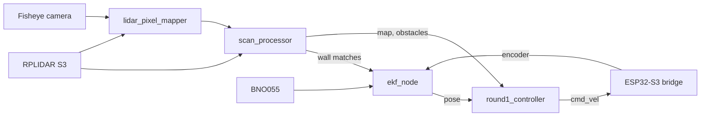

# Software architecture and obstacle strategy

<!--
Owner: software. Rubric criterion 3.
4 points: flowchart; modules and functions clearly explained; obstacle logic
described and reproducible.
6 points: state machine WITH rationale; justified algorithms (e.g. EKF, Stanley,
computer vision method); edge cases handled; testing and tuning process with
the metrics used to validate performance.
Level-6 example from the rules: "We tried bang-bang control, but it produced
oscillations near corners … We log the number of interventions per lap and
tuned the controller to minimise these interventions."
Figures planned: node/topic graph, state machine, control-cycle flowchart,
wall extraction steps, field map with obstacle seats and planned path,
Stanley tracking error, dead time, localisation quality, latency.
-->

## Architecture overview

<!-- ROS 2 nodes, topics, which process runs where (Jetson / ESP32). -->

## Localisation

## Perception: walls, pillars and colour

## Planning

## Control

## State machine

## Open challenge

## Obstacle challenge

## Parking and unparking

## Edge cases

## Testing and tuning
