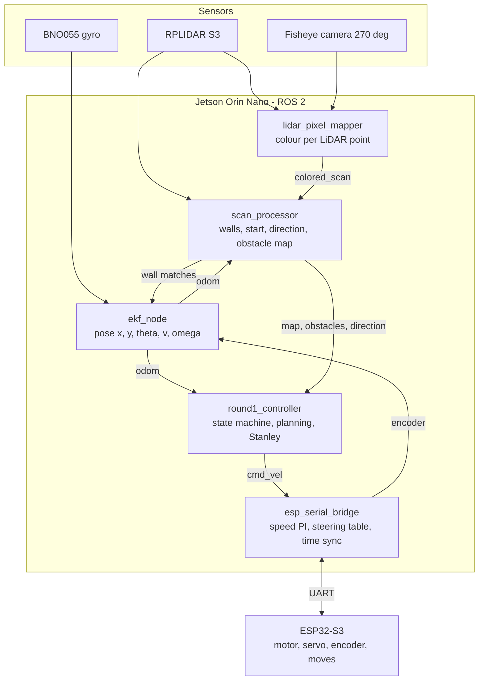
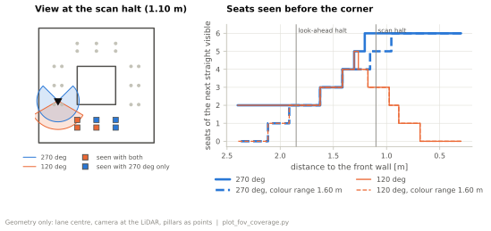
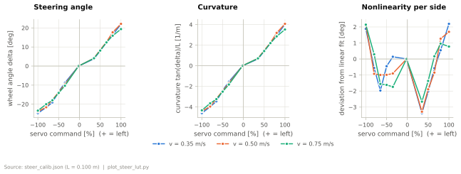
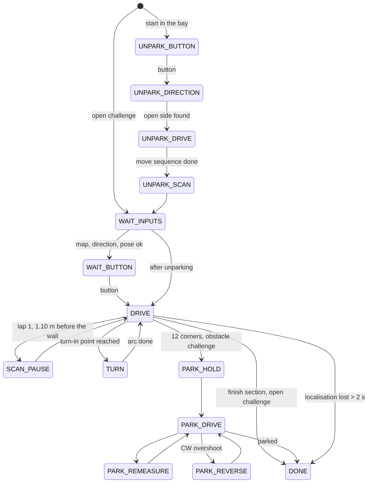

# Software architecture and obstacle strategy

<!--
Owner: software. Rubric criterion 3.
4 points: flowchart; modules and functions clearly explained; obstacle logic
described and reproducible.
6 points: state machine WITH rationale; justified algorithms; edge cases
handled; testing and tuning process with the metrics used.
DRAFT: facts from the code and the team's answers. Figures marked TODO come
from docs/analysis once the bags have been evaluated.
-->

## Architecture overview

The software runs on two controllers. The **Jetson Orin Nano** runs all
perception, estimation, planning and control as ROS 2 Humble nodes inside a
Docker container (jetson-containers). The **ESP32-S3** drives the motor and
the steering servo, counts the encoder, runs the position moves used for
unparking and parking and stops the motor if the Jetson falls silent. Both
talk over UART (115200 baud) with a binary protocol; the clocks are
synchronised every 10 s (NTP-style ping-pong, least-squares fit of offset and
drift), so that encoder samples from the ESP and IMU/LiDAR samples on the
Jetson share one time base.

| Node | Package | Rate | Job |
|---|---|---|---|
| `lidar_pixel_mapper` | camera_lidar_fusion | 15 Hz (camera) | projects every LiDAR point into the fisheye image and gives it a colour label |
| `scan_processor` | ekf | every scan | extracts walls, detects start position and direction, keeps the obstacle map, reports the localisation state |
| `ekf_node` | ekf | 50 Hz output | fuses gyro, encoder and wall matches into the pose |
| `round1_controller` | ekf | 30 Hz | state machine, path planning, Stanley / arc control, unparking and parking |
| `esp_serial_bridge` | esp_bridge | 100 Hz telemetry | turns `/cmd_vel` into motor and servo commands, speed control, time sync |
| `foxglove_overlay` | ekf | – | debug view (field, path, obstacles, run timer, CPU) |

The whole robot starts from one script (`src/start_robot.sh`), which the
autostart runs after boot; the controller waits for the start button.

## Localisation

The national-final robot computed its position from every single scan
(wall follower). One missing or wrong scan was enough to lose the lane.
The current robot keeps a continuous pose in a map of the field and only
corrects it with the walls it sees.

**Extended Kalman filter** (`ekf/ekf.py`). State
$[x, y, \theta, v, \omega, b_g]$ with a midpoint unicycle model for the
prediction. Measurements:

| Measurement | Model | Noise |
|---|---|---|
| gyro yaw rate | $z = \omega + b_g$ | $R = 2.83\cdot10^{-7}$ |
| encoder speed | $z = v$ ($r_\text{eff}$ = 15.0 mm) | $R = 9.3\cdot10^{-4}$ |
| standstill | $\omega = 0$ when $v < 0.03$ m/s | – |
| wall in Hesse normal form | $\alpha = \alpha_\text{map} - \theta$, $d = d_\text{map} - (x\cos\alpha_\text{map} + y\sin\alpha_\text{map})$ | $\mathrm{diag}(10^{-5}, 3.6\cdot10^{-6})$ |

Gyro and encoder samples arrive from two clocks; they are sorted by time
stamp in a 15 ms window before they enter the filter, so the filter never
predicts backwards.

**Wall extraction** (`wall_extraction.py`): clustering by gap (0.15 m),
split-and-merge at corners (max. 4 cm deviation), then a total-least-squares
line fit (SVD) per segment. The LiDAR delivers the points ordered by angle
and the field consists of a few long straight walls, so split-and-merge uses
that order directly, is deterministic and keeps the whole scan callback at
about 6 ms (median). Unlike RANSAC or a Hough transform it returns segments
with end points, which we need, e.g. to tell a 3 m wall from the 20 cm wall
of the parking bay. Splitting at corners was decisive: without it, L-shaped
corner clusters produced phantom walls, with it the heading drift dropped
from 25° to ±1.5°.

**Matching** against the map uses a gate on the innovation plus an overlap
check along the wall. If no wall matches, the gate opens in steps
(0.12 m/20° → 0.20/25° → 0.28/30° → 0.35/35°) after a fixed number of scans.
We first derived the gate from the EKF covariance, but without wall
corrections the covariance grew from only 0.2 to 5.8 cm in 30 s while the
real error grew to metres. The localisation state (`ok` / `recovering` /
`lost`) is published and used by the controller.

<!-- TODO figure: localisation quality from a bag (plot_localization.py) -->
<!-- TODO figure: EKF vs. folding-rule measurement (M1, plot_manual.py) -->

## Perception: walls, pillars and colour

The camera is a 270° fisheye mounted above the LiDAR. Instead of detecting
pillars in the image, every LiDAR point is projected into the image
(equidistant fisheye model, image circle found by a circle fit) and the
pixels around it vote for a colour label. The classification uses HSV ranges
plus a red/green index $(G - R)/\max(R, G, B)$ with a white-point correction
measured on the white mat in 12 sectors. The result is a point cloud with a
colour per LiDAR point, so every pillar has a distance and a colour at the
same time.

Pillars are found by region growing on the red/green points (radius 4 cm, at
least 5 points, at most 9 cm extent) and snapped to the 24 seats the rules
allow (at most 12 cm away). A seat is occupied after 3 votes; colour only
counts within 1.60 m, because beyond about 1.7 m red is read as green; at most
2 pillars per straight; the weaker of two seats in the same row needs at
least 35 % of the votes. A seat that the LiDAR sees through 6 times in a row
is cleared again (phantom pillars). At yaw rates above 0.6 rad/s no colour is
counted. After lap 1 the map is frozen.

Why the fisheye instead of the old 120° camera: at the scan halt 1.10 m
before the front wall, the 120° camera sees 3 of the 6 seats of the next
straight, the fisheye all 6 (Figure: fov coverage). The robot can plan the
next straight before it turns.

<!-- TODO figure: colour classification vs. distance (plot_colour_distance.py) -->

## Planning

**Corners** are tangential circular arcs between the entry and exit lane
lines. A constant curvature gives a constant feed-forward, and entry and exit
points follow exactly from the walls. $R = 0.50$ m puts the arc centre on the
inner corner of a 1 m lane when driving on the lane centre; with a short
run-up the radius shrinks down to 0.30 m, which keeps a margin above the
smallest drivable radius of about 0.22 m ($L / \tan 25°$). If a pillar lies
in the arc, the radius is reduced until about 8 cm clearance remain.

**Obstacles** are passed with a path in lane coordinates: red on the right,
green on the left. Lane changes are cosine ramps (0.40 m minimum,
0.70 m preferred length, 12 cm margin to the walls). They are tangential at
both ends, so Stanley sees no heading step; a front-loaded variant was
rejected because of a kink of about 15°. The path is re-planned whenever the
obstacle map changes.

## Control

**Stanley** on the whole path (straights, arcs and ramps):
$\delta = k_h(v)\,e_\theta + \arctan(k\,e_{ct}/v)$ plus path-curvature
feed-forward, $k = 1.2$, max. 25°. We started with a PD law on lateral and
heading error that commanded a yaw rate; it had problems with the lateral
offset, and Stanley turns both errors directly into a steering angle for a
front-steered car. Two additions came from test runs: a speed-dependent
heading gain and a **dead-time prediction** (measured 260 ms, gain 0.84) —
together they removed an oscillation of about ±8° with a period of about 1 s
after disturbed corner entries.

Reversing (parking) uses its own law $\delta = 1.5\,\psi - 6.7\,e$ because
Stanley is unstable backwards.

The bridge converts the commanded yaw rate into a steering angle with a
**measured steering table** per speed (0.35 / 0.50 / 0.75 m/s), because the
servo-to-wheel-angle curve is not linear and differs between left and right
by up to 4° at full lock. Speed is controlled on the Jetson (PI with
feed-forward) using the EKF speed.

<!-- TODO figure: dead time from a bag (plot_dead_time.py) -->
<!-- TODO figure: tracking error (plot_tracking.py) -->

## State machine

<!-- CHECK the transitions above against round1_controller (drawn from the
state list, not from every branch).
TODO rationale in the team's words: why separate states for scan halt,
turn and parking; what each state is allowed to do; which checks lead to DONE.
Mention the emergency manoeuvre (back up and re-plan, max. 2 per corner). -->

## Open challenge

The inner walls are unknown at the start. The robot measures its start
position and the lane width at standstill and uses a reduced map of the three
walls it sees. While driving it measures the width of every straight (sum of
both side distances, accepted within ±0.15 m of 0.60 or 1.00 m) and, as soon
as all four are known, reconstructs the inner band from the median widths and
adds it to the map. Speed 0.75 m/s, about 27 s for three laps.

## Obstacle challenge

Lap 1 is the scanning lap at 0.55 m/s: a short look-ahead halt 1.85 m and a
scan halt 1.10 m before each front wall, because the camera only gives
reliable colour at standstill (while driving the frame rate drops from 15.5 to
2.5 Hz and the share of coloured points from 38 to 2 %). From lap 2 the map is
frozen and the robot drives the planned path at 0.75 m/s, about 80 s for the
whole run.

## Parking and unparking

The start in the bay and the parking at the end use the same model.

- **Unparking** is a fixed sequence of moves (steering angle, distance) run
  by the ESP with the encoder. Positive steering always means "towards the
  open side", so one table serves both directions. The variant
  (inner / middle / outer) depends on the nearest pillar in front of the
  robot. Every sequence is checked in a dry run against the bay dimensions
  before it is driven.
- The map origin is the pose in the bay, so the bay position is known
  exactly at the end. **Parking** drives to the pose where unparking ended
  (averaged at the halt after unparking, plus the measured parking line and
  an offset per direction), approaches at 0.15 m/s, re-measures and then
  runs the unparking sequence backwards, correcting each move from the
  target headings.

| Runs | With final pose | Axle difference ≤ 2 cm | Heading error | Lateral deviation |
|---|---|---|---|---|
| 2–19 | 8 | 6/8 | up to 14° | up to 4.8 cm |
| 22–33 | 6 | 2/6 | 13–23° (outliers) | up to 4.1 cm |
| 35–46 (slow approach + heading correction) | 5 | 5/5 | ≤ 7° | 0.2–1.4 cm |

Values are the robot's own estimate (EKF), not measured with a ruler.
<!-- TODO: add ruler measurements from the next runs; figure plot_parking.py -->

## Edge cases

| Case | Handling |
|---|---|
| Pillar in or near the corner | side before/after the corner from the nearest pillar; radius reduced to 0.30 m until ~8 cm clearance; re-plan if a pillar appears after planning |
| Pillar seen late | path re-planned on every map change; slower on steep lane changes; look-ahead halt in lap 1 |
| Unknown colour | treated as red |
| Magenta bay walls | colour search only for red/green; bay walls masked geometrically out of wall matching; no pillars accepted in the outer column of the start straight |
| People / objects outside the field | colour only for LiDAR points; a pillar only counts within 12 cm of one of the 24 seats |
| Localisation lost | gate opens in steps; max. 0.20 m/s while recovering; emergency stop after 2 s lost |
| Gyro failure (I2C) | no messages > 0.5 s or exact zeros > 1 s → `gyro_ok = false` → localisation lost |
| Odometry gaps | short: hold last command, long: stop; ESP watchdog stops the motor 0.5 s without `/cmd_vel` |
| Contradicting direction | unparking does not start |
| Turn-in point missed | re-anchor the arc; if not drivable: back up and re-plan (max. 2 per corner), else emergency stop |
| Touching a wall or pillar | anything within 4 cm in front of the nose: stop and back up |
| Duplicate nodes | every node checks at start whether its output topic is already served |

## Testing and tuning

Every test run is recorded as a bag (`parken_test_1` … `_49`, before that
`cw_pos1_N`). Runs are evaluated offline: log, path against pillars, LiDAR
distances, camera colour per pillar over time, stopping distance, CPU per core
and process. New rules are replayed against old runs before they go on the
robot — e.g. the collision guard fires exactly at the wall contact of run 49
and never in run 48. Physical parameters come from calibration tools
(steering characteristic, speed, camera exposure/white balance,
camera-to-LiDAR rotation); geometry and logic are covered by unit tests
(unparking sequence, reversal, obstacle path, arc, anchoring, wall matching,
colours, fisheye model, white point, blind sectors). The evaluation scripts
are in `docs/analysis`.

<!-- TODO: metrics table from runs.csv (success rate, failure causes, lap
times) and the A/B test of the scan halt. -->
