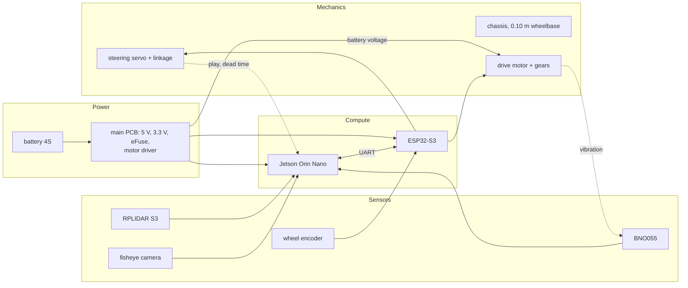
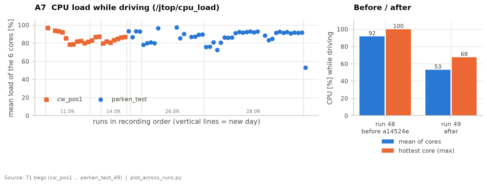

# Systems thinking and engineering decisions

<!--
Owner: all. Rubric criterion 4.
4 points: subsystems mapped and their interactions explained; constraints
mentioned.
6 points: explicit constraints; trade-offs; iteration cycles; risks and failure
modes with mitigation; "we chose X instead of Y because ..." based on data.
Status 30.09.: software rows checked against the code on main (20e2c13);
power and sensor rows taken from chapter 3. Mechanics rows are for Clemens.
Comments starting with CHECK need an answer from the team.
-->

## Subsystems and how they interact

The table lists the interfaces where one subsystem forced a decision in another.
Most of the software described in chapter 4 is a reaction to one of these rows.

| Interface | What we found | Consequence |
|---|---|---|
| Steering linkage → control | servo-to-wheel curve not linear and not symmetric: full lock +21.9° left, −24.7° right at 0.35 m/s, 19.4° left at 0.75 m/s; right steers ~40 % more per servo percent | measured steering table per speed in the bridge; arcs planned with R ≥ 0.30 m, well above the drivable minimum |
| Short wheelbase → control | about 250 ms from command to effect in the pose (servo, gyro, EKF, control loop); with 0.10 m wheelbase only ~28° phase margin, disturbances ring out with ~1 s period | dead-time prediction in both control laws |
| Encoder → power | with the encoder closing the speed loop, the motor voltage no longer has to be constant | the 12 V motor rail was removed from the PCB (chapter 3) |
| Jetson → power | the Jetson draws 76 % of the idle current; driving adds only 18 % | runtime is almost independent of speed, so speed is limited by control, not by energy |
| Jetson CPU → perception | fusion, estimation and control share six cores (~92 % load); scans waiting in a queue made wall corrections 0.35–0.6 s late | fusion limited to 7 Hz, CPU load down to ~53 %; scan queue depth 1 and grid clustering for the latency |
| Camera → strategy | while driving the camera frame rate drops from 15.5 to 2.5 Hz and coloured points from 38 to 2 % | scan halts in lap 1 only; map frozen after lap 1 |
| Camera and LiDAR placement → perception | the camera sits above the LiDAR, lens facing the ceiling; a board at the rear blocks both, so the software uses the same front 240° of both | every LiDAR point in view gets a colour; one rotation calibration links both |
| LiDAR minimum range → unparking | the LiDAR sees nothing closer than 0.15 m, the bay walls are exactly there | unparking and the last parking moves run as encoder moves on the ESP |
| Serial link → motor control | a round trip Jetson ↔ ESP adds delay | position moves controlled on the ESP, driving speed on the Jetson where the EKF speed is |
| Drive gear vibration → IMU | pitch noise grew with speed up to 3.4 °/s; the cause was an adapter running out of true (chapter 3) | the adapter was fixed (−86 % pitch noise at 0.2 m/s); the EKF uses only yaw, which stayed below 0.1 °/s |
| Motor current sense → safety | the current signal stays in the ADC's dead zone (chapter 3) | wall contact is detected with the LiDAR instead (4 cm in front of the nose) |
| ESP move overshoot → parking | position moves overshoot ~1.1 cm forwards but only 0.4 cm backwards | forward parking moves are 1.5 cm shorter |
| ESP position moves → reliability | a move that does not reach its target within 4 s aborts the run: 10 of 37 failed runs | open, see Risks |
| Start pose in the bay → whole run | the map origin is the pose in the bay; parking returns to it | estimation restarted before every run; the robot must not be moved after it |

<!-- CHECK (Clemens): add the mechanical interfaces (chassis stiffness, camera
mount, LiDAR height vs. wall height, ...) once chapter 2 is written. -->

## Constraints

| Constraint | Consequence |
|---|---|
| Ties are broken by time. At the German national final the sum of the best open and obstacle challenge times decided (same points as two other teams, 4th place on time); the international rules compare the points and then the time of the best obstacle round, the open challenge time only comes last | faster driving, above all in the obstacle challenge, needed a pose that does not depend on every single scan → EKF |
| The time runs until the robot stands in the bay, the international rules ask for no pause. The German rules differ: a 3 s stop after three laps, the time is taken there, and parking only has to be finished within the 3 minutes | no halt before parking; approach under closed-loop control instead of a stop and a blind move |
| Points before time: a run that fails costs more than a slow one | scan halts in lap 1 accepted although they cost time |
| Colour is only reliable at standstill (frame rate 15.5 → 2.5 Hz, coloured points 38 → 2 % while driving) | scan halts in lap 1 only; map frozen after lap 1 |
| Colour only reliable up to 1.60 m (red read as green beyond ~1.7 m) | votes from further away count as "something there" only |
| Six CPU cores shared by fusion, estimation and control | CPU load while driving reduced from 91.7 % to 53.1 % (commit a14524e, runs 48/49) |
| Wall corrections arrived 0.35–0.6 s after their scan (30–50° heading in a 90°/s corner) | queue depth 1 and grid clustering; remaining latency not compensated |
| The field is fourfold symmetric | global scan matching finds poses rotated by 90°; the start pose must come from start detection |
| Steering: 0.10 m wheelbase, 19–25° full lock, ~250 ms dead time | smallest drivable radius ~0.22 m; arcs ≥ 0.30 m; dead-time prediction |
| LiDAR blind below 0.15 m | encoder moves in the bay |
| Start procedure (rules 9.10–9.14): one switch, one start button, nothing measured before it | container and controller start from the autostart (boot 85–90 s) and wait for the button; direction, position and bay are detected after it |

<!-- CHECK (team): add your time constraint (test days / runs available after
the national final) as a row; it explains why every change is replayed
against recorded bags first. -->

## Decisions and trade-offs

| Decision | Alternatives considered | Why | Evidence |
|---|---|---|---|
| EKF with wall features | pose from every scan (wall follower, national final); ICP scan matching; particle filter | gyro and encoder bridge missing or wrong scans; the field is known and simple, so a few walls per scan are enough; the innovation of every wall is visible | ICP ran into local minima in our evaluations; global search gave 90° rotated poses (field symmetry) |
| Recursive split + SVD line fit | RANSAC, Hough transform | uses the angular order of the scan, deterministic, returns segment end points (bay wall vs. front wall) | scan callback ~6 ms median; heading drift 25° → ±1.5° after splitting at corners |
| Staged gate for wall matching | gate from the EKF covariance | covariance grew 0.2 → 5.8 cm in 30 s while the real error reached metres | before: 2.6 s from level 2 to 3 alone, 1.2 m blind; now worst case 10 scans (~0.7 s) from level 0 to 3 |
| Overlap check along the wall | distance/angle gate only | a segment beyond the end of a wall must not match it | `parken_test_20`: a pushed pillar 60 cm past the inner wall was matched, the pose stuck 50 cm behind |
| Only the newest scan (queue depth 1) | process every scan | a late wall correction pulls the heading back in a corner | corrections were 0.35–0.6 s late, 30–50° heading in a 90°/s corner |
| Colour per LiDAR point (fusion) | YOLOv11n on the camera image (national final) | lower latency; distance and colour in one measurement; camera and LiDAR use the same 240°, so a pixel exists for every LiDAR point | the old set-up no longer exists, so no direct latency comparison; field of view: 3 vs. 6 of 6 seats at the scan halt (fov_coverage) |
| Fisheye camera (240° used horizontally) | 120° CSI camera | sees the next straight before the corner | 3 vs. 6 of 6 seats at the scan halt |
| RPLIDAR S3 | STL-19P (used first), LakiBeam 1S | resolution, scan rate and range on the black walls; the LakiBeam is too large and blind to the rear | comparison table in [chapter 3](03-power-sensors.md#lidar-selection) |
| Colour limit 1.60 m | colour at any distance | beyond ~1.7 m red is read as green | test with a red pillar: 10/0 red/green votes at 1.2–1.6 m, 2/8 at 1.6–2.0 m, 0/16 beyond; pooled over 59 bags green is read as red for 25 % of its points at 1.4 m |
| See-through clearing of seats | keep every seat once occupied | phantom pillars caused unnecessary lane changes | replayed on the failed bags with phantom pillars: removed them there |
| One extended Stanley law for everything driven along a line (straights, obstacle ramps, start straight, parking approach); own laws for corners and for reversing | PD on lateral and heading error commanding a yaw rate; Stanley also in the corners | Stanley turns lateral and heading error directly into a steering angle for a front-steered car. Extended by a speed-scaled heading gain, the curvature feed-forward of the path, the dead-time prediction and a smoothed pose. A corner needs a constant feed-forward and ends on a heading, not at a point; Stanley is unstable backwards | the PD law had problems with the lateral offset; see the next rows for the extensions |
| Dead-time prediction | tune gains only | the dead time leaves little phase margin with the short wheelbase | simulated: ±2° instead of ±18° steering oscillation; 260 ms set, effective dead time measured at 235–250 ms |
| Curvature command in corners | feed-forward with the nominal corner speed | from standstill the old formula gave 58° steering (full lock) | full lock in corners 1 and 3 before the change |
| Feed-forward of the arc faded out over the last 20° before the exit heading | fading it out over only the last 7° (previous value) | at 1.5 rad/s the car turns 7° in 80 ms, less than the dead time: the steering still held the full arc curvature when the car reached the exit heading | before, it kept turning 13–34° past the exit; simulated overshoot 1° instead of 6.5° |
| Tangential arcs, cosine ramps | front-loaded ramp | constant curvature = constant feed-forward; ramps tangential at both ends | front-loaded ramp: ~15° kink |
| Collect detections over several views while driving, halts in lap 1 only | stop at the end of every straight in every lap | stopping costs time; one view cannot resolve two pillars in one row | TODO A/B test scan halt |
| No halt before parking | stop, then park (old behaviour) | the time runs until the robot is parked | – |
| Side rule ends at 1.915 m before the front wall | keep the pillar sides until the parking line | the rear is past the pillar row at the start of the straight; free planning gives a shorter approach | our reading of the rules, see chapter 4 |
| Controlled approach to the parking start pose (Stanley) | blind 55 cm ESP move | the blind move ended 12 cm beside and 17° skewed | log of the test run, comment in the controller |
| One reverse move with continuous steering | about nine 5 cm ESP moves; one blind move | fewer stops, the controller steers all the way | simulation: 0.4 cm / 1° instead of 3.4 cm / 8.6° for a blind move |
| Own park sequence with target headings from the drive model | reversed unpark sequence with the measured unpark trajectory as reference | works after every unpark variant, not only after the normal one | trade-off: the reference is a model, not a measured path |
| Unpark variant from the nearest pillar in front | pillar row 1.5 m before the front wall | the bay lies 1.25–1.97 m from the front wall depending on the layout | with the fixed row a green pillar 28 cm in front of the robot was missed and it unparked to the wrong side |
| Mask the bay geometrically | detect the magenta bay walls with the camera | magenta not detected reliably enough | – |
| Wall contact from the LiDAR | motor current | current signal stays in the ADC's dead zone (chapter 3) | the guard fires at the wall contact of run 49 and never in run 48 |
| Jetson Orin Nano + ROS 2 | Raspberry Pi 4 with plain Python classes (last season) | compute for fusion; ROS 2 as industry standard; bags for offline testing | – |

## Iterations

| Version | When | What changed | Result |
|---|---|---|---|
| v0 | season 2025 | Raspberry Pi 4 → Jetson | – |
| v1.0 (tag, commit 40f0dad) | national final, June 2026 | LiDAR wall follower (PID), YOLOv11n, IMU turn counting | full driving score, 29/30 documentation, 4th place on time |
| v2 (now) | after the national final | EKF + map, RPLIDAR S3, fisheye, camera-LiDAR fusion, Stanley, encoder | 71 recorded test runs: 17/22 races finished; parking 13/45 within 2 cm overall, 5/5 in runs 35–46 (chapter 4) |

Within v2 every change was driven by a recorded run. The CPU optimisation is a
typical cycle: the load had crept up to 92 % over the test day, the fusion got
only 2.8 camera images per second and paired scans with images 176 ms apart.
After commit a14524e the same measurement gives 53 % load, 8.9 images per second
and 23 ms between scan and image.

| | Run 48 (before) | Run 49 (after) |
|---|---|---|
| mean load of the 6 cores | 91.7 % | 53.1 % |
| hottest core (p95 / max) | 98 % / 100 % | 65 % / 68 % |
| camera images in the fusion | 2.8 Hz | 8.9 Hz |
| offset image – scan (median) | 176 ms | 23 ms |

Only one run was recorded after the change; the temperature stayed uncritical
(junction at most 60.7 °C, 9–10 W).

The most important cycles:

| Problem seen in a run | First attempt | Final solution |
|---|---|---|
| Heading drift 25° | line fit per cluster | split at corners before the fit (±1.5°) |
| Localisation lost after a blind stretch | gate from the EKF covariance | staged gate by scan count |
| Pushed pillar matched to a wall end | overlap check removed (it blocked correct matches) | overlap check re-added with a tolerance that widens with the gate level |
| Heading pulled back in corners | – | queue depth 1, grid clustering (corrections were 0.35–0.6 s late) |
| Bay wall taken as front wall, map 0.9 m off | – | minimum length 0.50 m and distance 0.60 m for the front wall |
| Phantom pillars | more votes per seat | see-through clearing, max. 2 per straight, 35 % rule |
| Magenta wall read as a red pillar | detect magenta with the camera | geometric mask of the bay; no pillars in the outer column of the start straight |
| Steering oscillation ±8–18° after corners | lower gains | dead-time prediction, smoothed steering pose |
| Full lock at the start of a corner | – | curvature command |
| Overshoot at the end of a corner | feed-forward blended over 7° | 20°, end on the predicted heading |
| Parking start pose 12 cm / 17° off | blind 55 cm ESP move | closed-loop approach |
| Parking accuracy 6/8 → 2/7 | – | heading correction at the start pose (run 35), closed-loop reverse (run 38): 5/5, median 0.3 cm (chapter 4) |
| Wrong unpark side with a green pillar in front | fixed pillar row | nearest pillar in front, filtered by its lateral position |
| IMU pitch noise up to 3.4 °/s | – | drive-gear adapter fixed (chapter 3) |

## Risks and failure modes

| Failure mode | Effect | Detection | Mitigation |
|---|---|---|---|
| ESP position move does not reach its target | run aborted (10 of 37 failed runs, the most frequent cause) | move timeout 4 s, status in the acknowledgement | open: raise the minimum duty (90) or accept a small remaining travel; timeouts only appear from run 19 although the parameters are unchanged since run 9 |
| Turn does not end | robot keeps turning at ~70° heading error (runs 20, 36) | – | open |
| Colour misread while moving | pillar passed on the wrong side | – | colour only at standstill / low yaw rate, votes, 1.60 m limit |
| Phantom pillar | unnecessary lane change, crash into the inner wall | LiDAR sees through the seat | seat cleared after 6 see-throughs |
| Camera misclassification without a pillar | the live mask cuts pieces out of a wall, fewer wall matches | – | open: only mask detections that would snap to a seat (not built) |
| Localisation lost | wrong path | localisation state | staged gate, slow down, emergency stop after 2 s |
| Late wall corrections | heading pulled back in corners | latency logged per scan | queue depth 1; remaining latency not compensated |
| Gyro failure (I2C) | heading drifts | watchdog on messages / zeros | `gyro_ok` checked before the start; during the run no reaction yet |
| Robot moved before the start / map from the previous run | parks at the wrong place | – | estimation restarted for every run, controller waits until gyro, bay and localisation are ok (40 s timeout) |
| Second estimation node running | map latched 8° rotated (run parken_test_14) | only doubled log lines | single-instance check in ekf_node and the controller; not yet in scan_processor |
| Pillar of the next straight in the unpark decision | wrong unpark variant | – | pillar must lie in the start lane |
| EKF speed outlier (−1.93 to +2.16 m/s seen) | the bridge converts yaw rate to steering with the EKF speed: wrong angle, full lock when starting | – | corner command curvature-based; speed clamped to 0.2–1.2 m/s in the Stanley law; no filter in the bridge yet |
| ESP keeps its last position target | after the next reset it drives back towards the old target | – | the controller sends motor 0 after parking |
| Last park move against the wall | pushes until the ESP timeout (4 s), costs time | move acknowledgement with status | forward moves 1.5 cm shorter; per-move correction |
| Battery voltage not measured | the reported value is a constant 17.518 V in all bags; a link between charge and failures cannot be checked | – | see chapter 3 |
| Camera re-enumerates on USB | no colour | – | fixed device name via udev |
| ESP reboot / clock jump | wrong time stamps | time sync detects the reboot | resync |
| Wall contact | robot pushes against the wall | LiDAR < 4 cm in front | stop, back up and re-plan; at most two manoeuvres per corner, then emergency stop |

<!-- CHECK (team): the build chat reports a last-move timeout of 4 s against the
wall and a first unpark move that drove ~5 cm backwards because the ESP kept
its old target. Neither is in the code comments; confirm or delete the row. -->

## Known limitations

- Colour detection while driving is not reliable; the robot needs the scan
  halts in lap 1.
- The LiDAR scan is not de-skewed for the wall extraction, and wall matches are
  applied with the current pose, not the pose at scan time. The fusion does
  compensate the motion between scan and image for the colour.
- Parking depends on the start pose in the bay, and the ESP position moves are
  the least reliable part of the run.
- Almost all test runs were driven at 0.35 m/s; the faster profile is new.
- The end of the three laps (switch at 1.915 m) is our reading of the rules.
- A gyro failure during the run is not handled yet.
- Parts of the algorithms are complex and need good sensor data.
